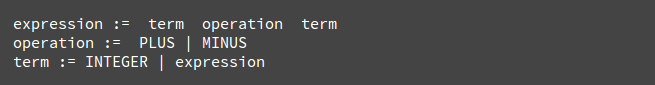

**Çevirmen**: *Mustafa Hasturk*

####Önsöz

Bu kapsamlı belge *Webkit* ve *Gecko* nın iç yapılarının araştırmasını içermektedir. İsrailli geliştirici *Tali Garsiel* uzun zaman ve emek harcayarak tarayıcıların kaynak kodlarını okumuş ve tarayıcıların iç yapısı ve çalışma mekanizması incelemiştir.  
  
  

Kendisi şöyle bir not düşmüş:
> IE'ın zamanlarında %90 gibi bir oranda hakimiyet sürerken tarayıcılara bir *kapalı kutu* olarak bakılıyor ve saygı duyuluyordu. Fakat şimdi açık kaynak tarayıcılar ile birlikte ______ÇEVİR_________. Tarayıcı çekirdeklerinin içine bakarak web tarayıcılarının içinde ne olduğunu görmek için tam sırası. Daha doğrusu milyonlarca C++ kodunun içinde ne olduğunu...

*Tali* araştırmalarını [kendi sitesinde](http://taligarsiel.com/) yayınladı fakat hepimiz biliyoruz ki daha fazla okuyucu kitlesini hak ediyor. Bu yüzden de çalışmayı düzenleyip burada yeniden yayınladık.

Bir web geliştiricisi olarak tarayıcı işlemlerinin iç yapısını öğrenmek bize daha iyi kararlar vermeyi ve geliştirmenin arkasındaki en iyi pratikleri bilmemizi sağlar. Bu belge oldukça uzun bir belge iken tüm detayları öğrenmek için biraz zaman harcamanızı öneriyoruz. Garanti ediyoruz ki harcadığınız zamana değecek. 

Ayrıca *Tali Garsiel*'in bu konu hakkındaki konuşmasını *Vimeo* üzerinden [buradan](http://vimeo.com/44182484) takip izleyebilirsiniz.

-----------------------------------------------------------------------------------------------------

##Giriş

Web tarayıcıları çok geniş çevrede kullanılan yazılımlardır. Bu el kitapçığı boyunca web tarayıcılarının arka planında neler döndüğünü ve nasıl çalıştığını anlatacağım. Tarayıcının adres çubuğuna `google.com` yazdığınızda taki ekranınıza *Google* yazısı gelinceye kadar neler döndüğüne bakacağız .

###Bahsedeceğimiz Tarayıcılar
Bu günlerde masaüstünde kullanılan beş ana tarayıcı şunlardır. *Opera*, *Chrome*, *Firefox*, *Safari* ve *Internet Explorer*. Mobil platformda ise ana tarayıcılar *Android Browser*, *iPhone*, *Opera Mini* ve *Opera Mobile*, *UC Browser*. Bu tarayıcıların bir çoğu *Webkit* i temel alıyor. Açık kaynak tarayıcılar olan *Chrome*, *Firefox* ve *Safari* (kısmen de olsa) den örnekler vereceğim.  
       
[StatCounter istatistiklerine](http://gs.statcounter.com/#all-browser-ww-monthly-201308-201408) göre tarayıcıların kullanım oranlarını resimden görebilirsiniz.

###Tarayıcıların Ana İşlevselliği
Tarayıcının ana görevi bizim seçtiğimiz web kaynağını, sunucuya istek yaparak ve tarayıcının penceresinde bize göstererek sunmaktır. Kaynak genellikle bir HTML belgesi iken PDF, görüntü veya farklı bir içeirk tipi de olabilir. Kaynağın konumu kullanıcı tarafından *URI* (Uniform Resource Identifier = Uniform_____ÇEVİR______ Kaynak Tanımlayıcı) kullanılarak belirtilir. 

Tarayıcı yorumlama ve HTML dosyalarının görüntülenmesinin yolu HTML ve CSS beyannamelerinde belirtilmiştir. Bu beyannameler [W3C](http://www.w3.org/) organizasyonu tarafından sürdürülmektedir ve bu organizasyon webin standartlarını oluşturmaktadır. Yıllardır tarayıcılar bu beyannamenin sadece belli bir kısmına uydular ve kendi uzantılarını geliştirdiler. Bunlar web yaratıcıları için ciddi uyumluluk sorunlarına neden oldu. Bugün ise bir çok tarayıcı bu beyannameye az veya çok şekilde uyuyorlar.

Tarayıcılar genel olarak çeşitli kullanıcı arayüzlerine sahipler. Bu genel arayüzler arasında;

* Adres (URI) girmek için kullanılacak bir adres çubuğu 
* İleri ve geri butonları
* Yer imleri seçeneği
* Geçerli belgeyi yenilemek veya durdurmak için gerekli yenileme ve durdurma butonları
* Ana sayfaya gitmek için kullanılacak ana sayfa butonu

yer almaktadır.  

Gariptir ki tarayıcıların kullanıcı arayüzleri herhangi bir resmi beyanname ile belirtilmemiştir. Bu arayüzler uzun yıllar süren, şekillenen iyi deneyimler ile meydana gelmektedir ve tarayıcılar birbirlerini taklit ederek / esinlenerek ilerlemektedirler. HTML5 beyannamesi, tarayıcıların sahip olması gerektiği herhangi bir UI yani kullanıcı arayüzü tanımlamaz fakat bazı ortak elemanları listeler. Bunların arasında; adres çubuğu, durum çubuğu ve araç çubuğu yer alır. UI yani kullanıcı arayüzü elemanları arasında tabi ki de tarayıcıya özgü elemanlar da vardır. Örneğin *Opera Browser*'ın *Discover* yani keşfet arayüzü gibi.

###Tarayıcının Yüksek Seviyeli Yapısı

Tarayıcının ana bileşenleri;  

1. **Kullanıcı arayüzü:** Adres çubuğu, ileri-geri butonu, yer imleri menüsü gibi elemanları içerir.  _____________ÇEVİR_____________

2. **Tarayıcı motoru:**: Rendering motoru ile kullanıcı arayüzü (UI) arasında sıraya koyma aksiyonlarını denetler.

3. **Rendering motoru::** İstek yapılmış içeriği görüntülemekten sorumludur. Örnek vermek gerekirse istek yapılmış içerik bir HTML ise rendering engine HTML ve CSS i çözümleri, ayrıştırır (parse) ve çözümlenmiş, ayrıştırılmış içeriği ekranda görüntüler. 

4. **Ağ iletişimi:** ağ (network) çağrıları örneğin HTTP istekleri için kullanılır. Platform bağımsız arayüzün arkasında farklı platformlar için farklı uygulamar kullanılır. 

5. **UI Arka Uç: (UI backend)** Combo boxes ve pencereler gibi basit grafiksel araçları çizmek için kullanılır. Bu arka uç (backend) platforma özel olmayan genel bir arayüz ortaya çıkarır 

6. **JavaScript Yorumlayıcı:** JavaScript kodlarını ayrıştırmak, çözümlemek (parse) ve çalıştırmak için kullanılır. 

7. **Veri Belleği: (data storage)** Bu bir süreklilik katmanıdır. Tarayıcı verilerin hepsini lokal olarak depolamaya ihtiyaç duyabilir. Çerezler (cookies) gibi. Ayrıca tarayıcılar farklı depolama mekanizmalarını da desteklerler. *localStorage, IndexedDB, WebSQL ve FileSystem* gibi.

##Rendering (Oluşturma) Motoru

Rendering motorunun sorumluluğu tam olarak rendering yani oluşturmak. Rendering istek yapılmış içeriği ekranda görüntülemektir. 

Varsayılan olarak rendering motoru HTML, XML belgelerinin yanı sıra resimleri görüntüleyebilir. Ayrıca eklentiler ve uzantılar sayesi ile diğer tip verileri görüntüleyebilir. Örneğin bir pdf eklentisi ile pdf dökümanları tarayıcı içerisinde görüntülenebilir. Fakat biz bu bölümde ana kullanım durumuna odaklanacağız. Ana kullanım durumumuz CSS ile biçimlenmiş HTML belgeleri ve resimleri görüntülemek.

###Rendering Motorları
Farklı tarayıcılar farklı rendering motorları kullanmaktadırlar.  
- *Chrome* ve *Opera* (15. sürümden itibaren) **Blink** (*WebKit*'in çatallanmış hali)  
- *Internet Explorer* **Trident**,  
- *Firefox* **Gecko**,  
- *Safari* **WebKit**  
kullanmaktadırlar. 

*WebKit* ilk zamanlar *Linux* platformu için oluşturulmuş açık kaynak bir rendering motorudur ve *Apple* tarafından *Mac* ve *Windows* platformunu desteklemek için değiştirilmiştir. Daha ayrıntılı bilgi için [webkit.org](http://www.webkit.org/)'a bakılabilir. 

###Ana Akış

Rendering motoru istek yapılmış belgenin içeriklerini ağ katmanından alacaktır. Bu işlem genellikle **8kB** ile gerçekleşecektir.  

Rendering motorunun temel akış diyagramı resimde görüldüğü gibidir.

Rendering motoru HTML belgesini çözümlemeye başlayacak ve belgedeki elementleri içerik ağacı olarak adlandırılan ağaçta yer alan [DOM](http://www.html5rocks.com/en/tutorials/internals/howbrowserswork/#DOM) düğümlerine çevirecek. Motor aynı zamanda hem harici CSS dosyalarını, hem de satır içi stilleri çözümlemeye başlayacak. HTML de bulunan görsel talimatlarla birlikte bulunan tasarım bilgileri başka bir ağacı oluşturmak için kullanılacak. Bu ağaç ise [render ağacı](http://www.html5rocks.com/en/tutorials/internals/howbrowserswork/#Render_tree_construction)  

Render ağacı, boyut ve renk gibi görsel nitelikler içeren dikdörtgenler içerir. Bu dikdörtgenler ekranda görüntülenmek üzere düzgün sıradadırlar.

Render ağacının inşası sonrası anahat düzeni ([layout](#layout)) süreci takip edilir. Bunun anlamı verilen her düğüm tam olarak ekranda görüntüleneceği sıradaki konumda bulunur. Bir sonraki aşama ise boyamadır ([painting](#painting)). Render ağacı işlenecek ve her bir düğüm UI arka uc (backend) katmanı kullanılarak boyanacaktır.  

Tüm bunların kademeli bir süreç olduğunu anlamak önemlidir. Daha iyi bir kullanıcı deneyimi için, render motoru, içeriği olabildiğince çabuk bir şekilde ekranda görüntülemeye çalışacaktır. Render ağacının inşası ve tasarım düzeninden önce tüm HTML in çözümlenmesini beklemeyecektir. İçeriğin bir bölümü, düğer içerikler ağ üzerinden gelirken ve süreç devam ederken işlenecek ve ekranda görüntülenecektir.

### Ana Akış Örnekleri
Şekil: **Webkit Ana Akışı**  
  
  
Şekil: **Gecko Ana Akışı**

Yukarıda ki iki akış diyagramlarına bakarak Webkit ve Gecko nun nispeten farklı terminolojilere sahip olduğunu görebilirsiniz. Ancak temel de akış aynıdır.

Gecko, görsel biçimlendirilmiş elementlerin ağacını "**Frame Tree, Çerçeve ağacı**" olarak adlandırıyor. Her element bir çerçeve. Webkit ise **"Render Tree, render ağacı**" terimini kullanıyor ve bu render nesnelerinden oluşuyor. Webkit elementleri yerleştirmek için "**layout**" terimini kullanıyor iken Gecko bunu "**reflow**" olarak adlandırıyor. "**Attachment**" Webkit'in DOM düğümlerine bağlanmak ve render ağaçlarını oluşturmak için kullandığı görsel bilgi için kullandığı bir terim. Burada ki ikincil anlamsal fark ise Gecko'nun HTML ve DOM ağacı arasında ekstra bir katmana sahip olması. Bu "**content sink, içerik alış noktası**" olarak adlandırılıyor ve DOM elementlerini oluşturmak için fabrika görevi üstleniyor. Bu akışın her parçasından bahsedeceğim.

### Parsing-general

Çözümleme (parsing) rendering motorunun içindeki çok önemli bir işlem olduğundan bu konuyu daha derinden değineceğiz. Kısa bir giriş ile çözümleme sürecine başlayalım.

Belgeyi çözümlemenin anlamı kodun kullanabileceği bir yapıya dönüştürmektir. Çözümleme işleminin sonucu genellikle, belgenin yapısını temsil eden düğümlerin ağacıdır. Bu genellikle **parse tree, çözümleme ağacı** veya **syntax tree, sözdizimi ağacı** olarak adlandırılır.

Örnek vermek gerekirse `2 + 3 - 1` bu ifadenin çözümlenmiş (parsing) hali aşağıdaki ağacı döndürür.

Şekil: **Matematiksel İfadenin Düğüm Ağacı

### Dilbilgisi

Sözdizimsel analiz belgenin yazılmış olduğu dil ve formatın yazım kurallarını temel alır. Çözümleme yapabileceğimiz her format kelime öbeği ve yazım kuralları olan belirleyici bir dilbilgisine sahip olmalıdır. Bu **[context free grammar](http://www.html5rocks.com/en/tutorials/internals/howbrowserswork/#context_free_grammar)** olarak adlandırılır. İnsanların kullandığı diller bunun gibi değildir ve bu yüzden geleneksel çözümleme teknikleri ile çözümlenemezler.

### Parser–Lexer Kombinasyonu

Sözdizimsel analiz (parsing) iki alt işleme ayrılabilir: sözcüksel analiz (**lexical analysis**) ve sözdizim analizi (**syntax analysis**).

Sözcüksel analiz girdileri, sembollere parçalama işlemidir. Semboller (tokens) dilin söz dağarcığıdır: geçerli (valid) yapım bloklarının koleksiyonudur.Bu semboller, insanların kullandığı dillerde sözlüklerde o dil için görülen kelimelerden meydana gelecektir.
 
Sözdizim analizi ise o dildeki sözdizimsel kuralların uygulanışıdır.

Genellikle çözümleyiciler yapılacak olan işi iki bileşene ayırırlar. **Lexer** (bazen *tokenizer* olarak da adlandırılır) girdileri geçerli sembollere (tokens) parçalama işinden sorumludur. **Parser** belgenin yapısını dilin sözdizimi kurallarına göre analiz ederek **parse tree** inşa etmekten sorumludur. *Lexer* boşluk karakteri ve satır sonları gibi alakasız karakterleri nasıl sıyıracağını / ayıracağını / çıkaracağını bilir.

Şekil: **Kaynak Belgeden Parse Ağacına**

Sözdizimsel analiz yinelemeli bir süreçtir. Parser genellikle *lexer* a yeni *token* olup olmadığını sorar ve bu *token* ile birlikte bir sözdizimi eşleştirmeye çalışır. Eğer bir eşleşme olursa o düğüm parse ağacına eklenir ve parser bir sonraki token ı bekler.

Eğer bir eşleşme bulunamaz ise parser o tokunu saklar ve eşleşecek olan token bulana kadar yeni token bekler.  Herhangi bir kural eşleşmesi olmaz ise parser bir istisna (exception) fırlatır. Bunun anlamı belge geçerli değildir ve sözdizimi hataları içerir.

#### Çeviri (Translation)

Bir çok durum için **parse tree** son ürün değildir. Sözdizimsel analiz (parsing) genellikle giriş dökümanını farklı bir formata dönüştürme de kullanılır. Örnek olarak derleme (**compilation**). Kaynak kodu makine koduna derleyen derleyici (**compiler**), ilk çözümlemede **parse tree** ye daha sonra da ağacı makine koduna dönüştürür. 

#### Sözdizimsel Analiz Örneği

Şekil 5 e göre matematiksel ifadeden bir parse ağacı inşa ettik. Basit matematiksel bir dil ifade edelim ve çözümleme/sözdizimsel analiz (parse) sürecini görelim.

Kelime hazinesi: Bizim yarattığımız dil tam sayıları, artı ve eksi işaretini içeriyor. 

Sözdizimi:
1. Dilin oluşturduğu bloklar ifadeler, terimler ve işlemlerdir.
2. Dilimiz herhangi sayıda ifade içereiblir.
3. Terimler işlemler ile bir araya gelerek ifadeleri oluştururlar. 
4. İşlemler artı veya eksidir. 
5. Terimler bir tamsayı veya ifadedir. 

Bu girişi analiz edelim. ` 2 + 3 -1 `
İlk alt sözcük `2` dir ve kural beşe göre bu bir ifadedir. Devamı ise ` 2 + 3 ` dür ve bu da kural 3 ile eşleşir. Bir sonraki eşleşme girişin son isabeti olmalıdır. ` 2 + 3 - 1 ` bir ifadedir çünkü biz çoktan ` 2 + 3 ` ün bir terim olduğunu biliyoruz. Elimizde bir sonraki terimi bir işlem ile birleştiren bir terim bulunmaktadır. ` 2 +  + ` herhangi bir kural ile eşleşmediği için geçersiz bir giriş olacaktır. 

#### Sözdizimi ve Kelime Dağarcığı için Format Tanımı 

Kelime dağarcığı genellikle [Düzenli İfadeler](http://www.regular-expressions.info/ "Regular Expression") ile ifade edilir.

Örneğin bizim dilimiz aşağıdaki gibi tanımlanmış olsun:

Gördüğünüz gibi tamsayılar düzenli ifadeler olarak tanımlanmıştır. 

Sözdizimi [BNF](http://en.wikipedia.org/wiki/Backus%E2%80%93Naur_Form) olarak adlandırılan bir formatta tanımlanır. Bizim dilimiz böyle tanımlanacaktır. 

Eğer dilbilgisi **context free grammar** olarak tanımlandı ise o dil **regular parser** lar ile çözümlenebilir. **Context free grammar** ın sezgisel tanımı ise; tamamen **BNF** ile ifade edilebilen dilbilgisidir. Format tanımını için: [İçerikten-bağımsız Dilbilgisi - Vikipedia](http://en.wikipedia.org/wiki/Context-free_grammar)

#### Ayrıştırıcı/Çözümleyicinin Tipleri
İki tip çözümleyici vardır: Yukarıdan aşağı çözümleyici, aşağıdan yukarı çözümleyici. Yukarıdan aşağı çözümleyicinin sezgisel açıklanışı, sözdizimin yüksek seviyeli yapısını inceleyerek eşleşen bir kural bulmaya çalışır. Aşağıdan yukarı çözümleyici ise girişi alır ve adım adım sözdizimi kuralına döüştürür ve düşük seviyeden yüksek seviyeye çözümler.

İki farklı çözümleyicinin bizim örneğimizi nasıl ayrıştıracağına bakalım.

**top-down** çözümleyici en yüksek kuraldan ifadeyi çözümlemeye başlar. ` 2 + 3 ` ü bir ifade olarak tanımlar. Daha sonra bu ` 2 + 3 -1 ` in bir ifade olduğunu tanımlar. Tanımlamanın süreci aşama aşamadır ancak her zaman yüksek seviyeden başlanır. 

**bottom-up** çözümleyici girişi bir kural eşleşmesi bulana kadar tarayacaktır. Eşleşen girişi kural ile değiştirecektir. Bu girişin sonu gelene kadar devam edecektir. Kısmen eşleşmiş olan ifadeler çözümleyicinin yığınında saklanır. 

Bu tip **bottom-up** çözümleyiciler **shift-reduce parser** olarak adlandırılır. Çünkü giriş sağa doğru kaydırılır (ilk girişi gösteren ve sağa doğru kayan bir pointer düşünülebilir) ve aşamaları olarak sözdizimi kuralına indirgenir. 

#### Otomatik Olarak Çözümleyici Üretmek

Ayrıştırıcı oluşturan araçlar vardır. Bu araçları dilin sahip olduğu dilbilgisi (kelime dağarcığı + sözdizimi) ile beslersiniz ve onlar çalışan ayrıştırıcı üretirler. Çözümleyici üretmek çözümleme sürecini derin olarak anlamaktan geçer ve el ile optimize olmuş bir çözümleyici oluşturmak kolay değildir. Bu yüzden çözümleyici oluşturucular çok kullanışlıdır. 

Webkit iyi bilinen iki çözümleyici üretici kullanmaktadır. [Flex](http://en.wikipedia.org/wiki/Flex_lexical_analyser) lexer oluşturmak için ve [Bison](http://www.gnu.org/software/bison/) ise ayrıştırıcı (parser) oluşturmak içindir. Flex girişleri tokenların düzenli ifade tanımlarını içeren bir dosyadır. Bison un girişleri ise BNF formatında tanımlanmış dilin sözdizimi kurallarıdır. 

### HTML Çözümleyici

HTML çözümleyicinin görevi HTML işaretlerini çözümleyerek parse treeye çevirmektir.

#### HTML Gramer Tanımı

HTML in dil ve sözdizimi özellikleri W3C tarafından oluşturulan [spesifikasyonlarda](http://www.html5rocks.com/en/tutorials/internals/howbrowserswork/#w3c) tanımlanmıştır. 

#### İçerik Bağımsız Değildir

Çözümleme tanıtımında gördüğümüz gibi, dilbilgisi sözdizimi usulen BNF gibi bir format kullanılarak tanımlanabilir.

Ne yazık ki geleneksel tüm çözümleme konuları HTML’e uygulanmaz.(Bunlardan sadece eğlence olsun diye bahsetmedim. CSS ve Javascript konularında kullanılacaklar). HTML, basitçe derleyicilerin ihtiyacı olan bağlamdan bağımsız bir dilbilgisi olarak tanımlanamaz.

HTML-DTD (Document Type Definition)’yi tanımlamak için resmi bir format vardır. Fakat bu format içerikten bağımsız bir dilbilgisi değildir.

Bu ilk bakışta tuhaf gözükebilir. HTML, XML’e oldukça yakındır. Birçok XML çözümleyici mevcuttur. HTML-XHTML in bir XML varyasyonu vardır. Peki büyük fark nerededir?

Fark şuradadır. HTML’in yaklaşımı daha hoşgörülüdür. Belirli etiket (tag) leri(Sonradan kapalı bir şekilde eklenen), bazen başlangıç ve bitiş etiketlerini ihmal etmenize olanak sağlar. XML’in katı ve zahmetli sintaksının aksine bütün olarak hafif bir sintaksı vardır.

Küçük görünen bu detay birçok fark yaratır. Diğer yandan bu detay HTML’in neden çok popüler olduğunun ana sebebidir. HTML sizin hatalarınızı affeder ve böylece web yazarlarının hayatını kolaylaştırır. Buna karşılık, resmi bir şekilde yazmayı zorlaştırır. Özetleyecek olursak, HTML’in grameri içerikten bağımsız olduğundan dolayı, geleneksel derleyiciler tarafından kolaylıkla çözümlenemez. HTML, XML derleyicileri tarafından çözümlenemez. 

#### HTML DTD

HTML’in tanımı DTD formatının içinde saklıdır. Bu format SGML ailesinden gelen dilleri tanımlamak için kullanılır. Yine bu format tüm izin verilmiş elemanlar, bu elemanların davranışları ve hiyerarşisi için açıklamalar içerir. Daha önceden gördüğümüz üzere, HTML DTD içerik bağımsız bir gramer oluşturmaz.

DTD’nin birkaç çeşidi vardır. Kuralcı olan mod sadece spesifikasyonlara uymaktadır. Diğer modlar ise geçmiş tarayıcılar tarafından kullanılan işaretlemeler için destek sağlamaktadır. Buradaki amaç eski içerikler için geriye dönük uyumluluk sağlamaktır. Güncel kuralcı DTD’ye ulaşmak için: 

#### DOM
Çözümleme ağacı(Parse Tree) DOM elemanlarının ve özellik düğümleri(attribute nodes) nin bir ağacıdır. “Document Object Model” in kısaltılmış halidir. DOM’un bize görünen yüzü, bir HTML dökümanının ve HTML arayüz elemanlarının nesne olarak sunumudur. Tıpkı Javascript’ te olduğu gibi. Bu ağacın kökü ise [döküman](http://www.w3.org/TR/1998/REC-DOM-Level-1-19981001/level-one-core.html#i-Document) nesnesidir.

DOM’un neredeyse işaretleme elemanlarıyla birebir ilişkisi vardır. Örneğin,

Yukarıdaki biçim aşağıdaki DOM ağacı şekiline çevrilebilir.

HTML’de olduğu gibi, DOM’un da özellikleri W3C tarafından belirlenmiştir. İncelemek için www.w3.org/DOM/DOMTR. DOM, dökümanların içeriklerini değiştirmek için oluşturulmuş genel bir şartnamedir. Ayrıca HTML’in spesifik elemanlarını tanımlayan bir modüldür. HTML’in tanımlarına ulaşmak için: .

Çözümleme ağacı(parse tree) DOM düğümlerini içerir derken, bu ağacın DOM arayüzlerinden bir tanesini implement eden elemanlardan kurulduğunu söyleyebiliriz. Tarayıcılar, tarayıcı tarafından dahili olarak kullanılan diğer özelliklere sahip somut implementasyonlar içerirler.

#### Çözümleme Algoritması
Bir önceki bölümde gördüğümüz üzere, bir HTML dosyası baştan aşağı ya da sondan başa tarama yapan sıradan derleyiciler tarafından derlenemez.
Bunun nedenleri şunlardır:

1. Affedici yapıya sahip bir dil olması.
2. Tarayıcıların çok iyi bilinen geçersiz HTML durumlarına karşı geleneksel hata toleranslarının olması.
3. Derleme aşaması yeniden girişlidir. Diğer dillerde kaynak kod derleme aşamasında değişmezken HTML’de dinamik kod (document.write() çağrıları içeren script elemanları gibi) ekstra işaretler ekleyebilir. Yani derleme aşaması girdiyi değiştirir.

Sıradan derleme teknikleri işe yaramayacağından dolayı tarayıcılar kendi derleyicilerini oluşturlar. Derleme algoritması HTML5 spesifikasyonlarında detaylı bir şekilde tanımlanmıştır. Bu algoritma 2 aşamadan oluşur: sembollere ayırma ve ağaç oluşumu. 

Sembollere ayırma görevi, girdiyi sembollere çözümleyen sözlüksel analiz(lexical analysis) dir. Bu semboller HTML içindeki başlangıç, bitiş etiketleri, özellik(attribute) isimleri ve değerleridir.

Sembollere ayıran mekanizma sembolü tanır, onu ağaç oluşturucusuna verir ve bir sonraki karakteri bir sonraki sembolü tanımak üzere kullanır. Bu işlem girdinin sonuna kadar tekrarlanır.

**Şekil:** HTML Çözümleme Akışı
")

#### Sembollere Ayırma Algoritması (The Tokenization Algorithm)
Sembollere ayırma algoritmanın çıktısı bir HTML sembolüdür. Bu algoritma bir durum makinesi(state machine) olarak ifade edilir. Her durum bir ya da daha fazla karakter girdisi kullanır ve bir sonraki durumu o karakterlere göre günceller. Karar mekanizması, mevcut sembollere ayırma durumu ve ağaç oluşumu durumu tarafından etkilenir. Bu mevcut duruma bağlı olarak, kullanılan aynı karakter bir sonraki doğru durum için farklı sonuçlar verir anlamı taşır. Bu algoritma, tam olarak tanımının yapılabilmesi açısından çok kompleksdir. Bu yüzden çalışma prensibini anlamamız açısından basit bir örnek incelemek bize yardımcı olacaktır.

Aşağıdaki HTML kodu temel bir sembollerine ayrıştırma örneğidir:

Başlangıç durumu “Veri durumu(Data state)”dur. ‘<’ karakteriyle karşılaşıldığında, durum(state) “etiket açık durumu(tag open state)” olarak değişir. A-z arasında bir karakter kullanmak “etiket sembolünü başlat (start tag token)” oluşumuna yol açar ve bu durum “etiket ismi durumu(tag name state)”na dönüşür. Bu durum ‘>’ karakteri kullanılıncaya kadar aynı kalır. Her karakter yeni sembol ismine eklenir. Yukarıdaki durumda oluşturulan sembol bir html sembolüdür. 

‘>’ ile birlikte etiket tamamlandığında, mevcut olan sembol ifade edilmiş olur ve durum(state) yine “Veri durumu (Data state)” olarak değişir. <body> etiketi de aynı aşamalardan geçerek işlem görür. Şimdiye kadar html ve body etiketleri ifade edilmiş oldu. Şimdi tekrar “Veri durumu (Data state)” ndayız. “Hello world” ifadesindeki H karakteri bir oluşuma ve karakter sembolünü ifade etmeye yol açar, ve bu </body> etiketindeki < karakterine ulaşılıncaya kadar devam eder.”Hello world” ifadesindeki her karakter için bir karakter sembolü ifade edeceğiz. 

Şu an “etiket açık durumu (tag open state)” ndayız. ‘/’ girdisini kullanmak “etiket sonu sembolü(end tag token)” oluşumuna yol açar ve bu durum “etiket ismi durumu(tag name state)”na dönüşür. İlk aşamada olduğu gibi ‘>’ sembolüyle karşılaşılıncaya kadar bu durumda kalırız. Bu sembolle karşılaştıktan sonra yeni etiket ifade edilecektir. Daha sonra da “Veri durumu(Data state)” na geri döneriz. </html> girdisi ise önceki durumdaki gibi işlenecektir.

**Şekil:** Girileri Sınıflandırma Örneği

#### Ağaç Yapısı Algoritması(Tree Construction Algorithm)

Çözümleyici oluşturulduğunda döküman nesnesi de oluşturulur. Ağaç oluşumu sürecinde, kökünde döküman bulunan DOM tree modifiye edilir ve elemanlar bu ağaca eklenir. Bu ağaçtaki sembollerine ayırıcı tarafından tanımlanan her bir düğüm ağaç oluşturucusu tarafından işlenecektir. Her bir düğüm için şartname, hangi DOM elemanının o düğümle ilişkili olduğunu tanımlar ve bu sembol için hangi DOM elemanının oluşturulacağını tanımlar. Elemanlar DOM ağacına ve açık elemanların yığınına eklenir. Bu yığın uyumsuz ve kapatılmamış etiketleri doğru bir şekilde yapmak için kullanılır. Bu algoritma ayrıca durum makinesi olarak tanımlanır. Bu durum **insertion modes** olarak adlandırılır. 

Örnek bir giriş için ağacın yapı sürecine bakalım:

Ağacın yapım aşaması girdisi, işaretleme kademesindendan gelen işaret dizisidir. İlk düğüm **initial mode** dur. *html* token almak **before html** durumuna geçmesine ve bu durumda yeniden işlenmesine neden olacaktır. Bu durum root Document objesine eklenecek olan HTMLHtmlElement elemanı oluşmasına neden olacaktır. 

Durum **before head** e geçilecektir.  *Body* token alınmış olur. Body token y eniden işlenir, *HTMLBodyElement* oluşturulur, yerleştirilir ve durum **in body** ye aktarılır. 

"Hello world" kelime grubunun karakter tokenları şimdi alınır. İlki oluşmasına ve *Text* düğümünün eklenmesine neden olur ve diğer karakterler bu düğüme eklenir. 

*Body end* tokenın alınması **after body** moduna geçilmesine neden olur. Şimdi bizi **after after body** moduna geçirecek olan html bitiş etiketini alacağız. Dosya sonu tokenı almak çözümleme işlemini bitirecektir. 

**Şekil:** Örnek HTML in Ağaç Yapısı

#### Çözümleme Bittiğindeki Aksiyonlar

