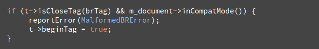
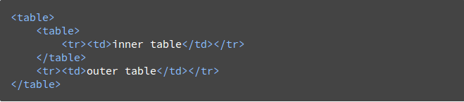
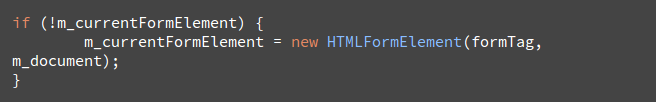
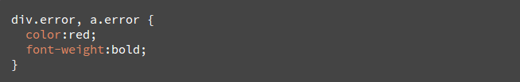

**Çevirmen**: *Mustafa Hasturk*

####Önsöz

Bu kapsamlı belge *Webkit* ve *Gecko* nın iç yapılarının araştırmasını içermektedir. İsrailli geliştirici *Tali Garsiel* uzun zaman ve emek harcayarak tarayıcıların kaynak kodlarını okumuş ve tarayıcıların iç yapısı ve çalışma mekanizması incelemiştir.  
  
  

Kendisi şöyle bir not düşmüş:
> IE'ın zamanlarında %90 gibi bir oranda hakimiyet sürerken tarayıcılara bir *kapalı kutu* olarak bakılıyor ve saygı duyuluyordu. Fakat şimdi, pazar payı yarıdan fazla olan açık kaynaklı tarayıcılarla birlikte tarayıcı çekirdeklerinin altında ne olduğuna bakarak orada ne olduğunu görmek için tam sırası. Daha doğrusu milyonlarca C++ kodunun içinde ne olduğunu...

*Tali* araştırmalarını [kendi sitesinde](http://taligarsiel.com/) yayınladı fakat hepimiz biliyoruz ki daha fazla okuyucu kitlesini hak ediyor. Bu yüzden de çalışmayı düzenleyip burada yeniden yayınladık.

Bir web geliştiricisi olarak tarayıcı işlemlerinin iç yapısını öğrenmek bize daha iyi kararlar vermeyi ve geliştirmenin arkasındaki en iyi pratikleri bilmemizi sağlar. Bu belge oldukça uzun bir belge iken tüm detayları öğrenmek için biraz zaman harcamanızı öneriyoruz. Garanti ediyoruz ki harcadığınız zamana değecek. 

Ayrıca *Tali Garsiel*'in bu konu hakkındaki konuşmasını *Vimeo* üzerinden [buradan](http://vimeo.com/44182484) takip izleyebilirsiniz.

-----------------------------------------------------------------------------------------------------

##Giriş

Web tarayıcıları çok geniş çevrede kullanılan yazılımlardır. Bu el kitapçığı boyunca web tarayıcılarının arka planında neler döndüğünü ve nasıl çalıştığını anlatacağım. Tarayıcının adres çubuğuna `google.com` yazdığınızda taki ekranınıza *Google* yazısı gelinceye kadar neler döndüğüne bakacağız .

###Bahsedeceğimiz Tarayıcılar
Bu günlerde masaüstünde kullanılan beş ana tarayıcı şunlardır. *Opera*, *Chrome*, *Firefox*, *Safari* ve *Internet Explorer*. Mobil platformda ise ana tarayıcılar *Android Browser*, *iPhone*, *Opera Mini* ve *Opera Mobile*, *UC Browser*. Bu tarayıcıların bir çoğu *Webkit* i temel alıyor. Açık kaynak tarayıcılar olan *Chrome*, *Firefox* ve *Safari* (kısmen de olsa) den örnekler vereceğim.  
       
[StatCounter istatistiklerine](http://gs.statcounter.com/#all-browser-ww-monthly-201308-201408) göre tarayıcıların kullanım oranlarını resimden görebilirsiniz.


###Tarayıcıların Ana İşlevselliği
Tarayıcının ana görevi bizim seçtiğimiz web kaynağını, sunucuya istek yaparak ve tarayıcının penceresinde bize göstererek sunmaktır. Kaynak genellikle bir HTML belgesi iken PDF, görüntü veya farklı bir içeirk tipi de olabilir. Kaynağın konumu kullanıcı tarafından *URI* (Uniform Resource Identifier = Uniform Kaynak Tanımlayıcı) kullanılarak belirtilir. 

Tarayıcı yorumlama ve HTML dosyalarının görüntülenmesinin yolu HTML ve CSS beyannamelerinde belirtilmiştir. Bu beyannameler [W3C](http://www.w3.org/) organizasyonu tarafından sürdürülmektedir ve bu organizasyon webin standartlarını oluşturmaktadır. Yıllardır tarayıcılar bu beyannamenin sadece belli bir kısmına uydular ve kendi uzantılarını geliştirdiler. Bunlar web yaratıcıları için ciddi uyumluluk sorunlarına neden oldu. Bugün ise bir çok tarayıcı bu beyannameye az veya çok şekilde uyuyorlar.

Tarayıcılar genel olarak çeşitli kullanıcı arayüzlerine sahipler. Bu genel arayüzler arasında;

* Adres (URI) girmek için kullanılacak bir adres çubuğu 
* İleri ve geri butonları
* Yer imleri seçeneği
* Geçerli belgeyi yenilemek veya durdurmak için gerekli yenileme ve durdurma butonları
* Ana sayfaya gitmek için kullanılacak ana sayfa butonu

yer almaktadır.  

Gariptir ki tarayıcıların kullanıcı arayüzleri herhangi bir resmi beyanname ile belirtilmemiştir. Bu arayüzler uzun yıllar süren, şekillenen iyi deneyimler ile meydana gelmektedir ve tarayıcılar birbirlerini taklit ederek / esinlenerek ilerlemektedirler. HTML5 beyannamesi, tarayıcıların sahip olması gerektiği herhangi bir UI yani kullanıcı arayüzü tanımlamaz fakat bazı ortak elemanları listeler. Bunların arasında; adres çubuğu, durum çubuğu ve araç çubuğu yer alır. UI yani kullanıcı arayüzü elemanları arasında tabi ki de tarayıcıya özgü elemanlar da vardır. Örneğin *Opera Browser*'ın *Discover* yani keşfet arayüzü gibi.

###Tarayıcının Yüksek Seviyeli Yapısı

Tarayıcının ana bileşenleri;  

1. **Kullanıcı arayüzü:** Adres çubuğu, ileri-geri butonu, yer imleri menüsü gibi elemanları içerir.

2. **Tarayıcı motoru:**: Rendering motoru ile kullanıcı arayüzü (UI) arasında sıraya koyma aksiyonlarını denetler.

3. **Rendering motoru::** İstek yapılmış içeriği görüntülemekten sorumludur. Örnek vermek gerekirse istek yapılmış içerik bir HTML ise rendering engine HTML ve CSS i çözümleri, ayrıştırır (parse) ve çözümlenmiş, ayrıştırılmış içeriği ekranda görüntüler. 

4. **Ağ iletişimi:** ağ (network) çağrıları örneğin HTTP istekleri için kullanılır. Platform bağımsız arayüzün arkasında farklı platformlar için farklı uygulamar kullanılır. 

5. **UI Arka Uç: (UI backend)** Combo boxes ve pencereler gibi basit grafiksel araçları çizmek için kullanılır. Bu arka uç (backend) platforma özel olmayan genel bir arayüz ortaya çıkarır 

6. **JavaScript Yorumlayıcı:** JavaScript kodlarını ayrıştırmak, çözümlemek (parse) ve çalıştırmak için kullanılır. 

7. **Veri Belleği: (data storage)** Bu bir süreklilik katmanıdır. Tarayıcı verilerin hepsini lokal olarak depolamaya ihtiyaç duyabilir. Çerezler (cookies) gibi. Ayrıca tarayıcılar farklı depolama mekanizmalarını da desteklerler. *localStorage, IndexedDB, WebSQL ve FileSystem* gibi.


##Rendering (Oluşturma) Motoru

Rendering motorunun sorumluluğu tam olarak rendering yani oluşturmak. Rendering istek yapılmış içeriği ekranda görüntülemektir. 

Varsayılan olarak rendering motoru HTML, XML belgelerinin yanı sıra resimleri görüntüleyebilir. Ayrıca eklentiler ve uzantılar sayesi ile diğer tip verileri görüntüleyebilir. Örneğin bir pdf eklentisi ile pdf dökümanları tarayıcı içerisinde görüntülenebilir. Fakat biz bu bölümde ana kullanım durumuna odaklanacağız. Ana kullanım durumumuz CSS ile biçimlenmiş HTML belgeleri ve resimleri görüntülemek.

###Rendering Motorları
Farklı tarayıcılar farklı rendering motorları kullanmaktadırlar.  
- *Chrome* ve *Opera* (15. sürümden itibaren) **Blink** (*WebKit*'in çatallanmış hali)  
- *Internet Explorer* **Trident**,  
- *Firefox* **Gecko**,  
- *Safari* **WebKit**  
kullanmaktadırlar. 

*WebKit* ilk zamanlar *Linux* platformu için oluşturulmuş açık kaynak bir rendering motorudur ve *Apple* tarafından *Mac* ve *Windows* platformunu desteklemek için değiştirilmiştir. Daha ayrıntılı bilgi için [webkit.org](http://www.webkit.org/)'a bakılabilir. 

###Ana Akış

Rendering motoru istek yapılmış belgenin içeriklerini ağ katmanından alacaktır. Bu işlem genellikle **8kB** ile gerçekleşecektir.  

Rendering motorunun temel akış diyagramı resimde görüldüğü gibidir.


Rendering motoru HTML belgesini çözümlemeye başlayacak ve belgedeki elementleri içerik ağacı olarak adlandırılan ağaçta yer alan [DOM](http://www.html5rocks.com/en/tutorials/internals/howbrowserswork/#DOM) düğümlerine çevirecek. Motor aynı zamanda hem harici CSS dosyalarını, hem de satır içi stilleri çözümlemeye başlayacak. HTML de bulunan görsel talimatlarla birlikte bulunan tasarım bilgileri başka bir ağacı oluşturmak için kullanılacak. Bu ağaç ise [render ağacı](http://www.html5rocks.com/en/tutorials/internals/howbrowserswork/#Render_tree_construction)  

Render ağacı, boyut ve renk gibi görsel nitelikler içeren dikdörtgenler içerir. Bu dikdörtgenler ekranda görüntülenmek üzere düzgün sıradadırlar.

Render ağacının inşası sonrası anahat düzeni ([layout](#layout)) süreci takip edilir. Bunun anlamı verilen her düğüm tam olarak ekranda görüntüleneceği sıradaki konumda bulunur. Bir sonraki aşama ise boyamadır ([painting](#painting)). Render ağacı işlenecek ve her bir düğüm UI arka uc (backend) katmanı kullanılarak boyanacaktır.  

Tüm bunların kademeli bir süreç olduğunu anlamak önemlidir. Daha iyi bir kullanıcı deneyimi için, render motoru, içeriği olabildiğince çabuk bir şekilde ekranda görüntülemeye çalışacaktır. Render ağacının inşası ve tasarım düzeninden önce tüm HTML in çözümlenmesini beklemeyecektir. İçeriğin bir bölümü, düğer içerikler ağ üzerinden gelirken ve süreç devam ederken işlenecek ve ekranda görüntülenecektir.

### Ana Akış Örnekleri
Şekil: **Webkit Ana Akışı**  
  
  
Şekil: **Gecko Ana Akışı**


Yukarıda ki iki akış diyagramlarına bakarak Webkit ve Gecko nun nispeten farklı terminolojilere sahip olduğunu görebilirsiniz. Ancak temel de akış aynıdır.

Gecko, görsel biçimlendirilmiş elementlerin ağacını "**Frame Tree, Çerçeve ağacı**" olarak adlandırıyor. Her element bir çerçeve. Webkit ise **"Render Tree, render ağacı**" terimini kullanıyor ve bu render nesnelerinden oluşuyor. Webkit elementleri yerleştirmek için "**layout**" terimini kullanıyor iken Gecko bunu "**reflow**" olarak adlandırıyor. "**Attachment**" Webkit'in DOM düğümlerine bağlanmak ve render ağaçlarını oluşturmak için kullandığı görsel bilgi için kullandığı bir terim. Burada ki ikincil anlamsal fark ise Gecko'nun HTML ve DOM ağacı arasında ekstra bir katmana sahip olması. Bu "**content sink, içerik alış noktası**" olarak adlandırılıyor ve DOM elementlerini oluşturmak için fabrika görevi üstleniyor. Bu akışın her parçasından bahsedeceğim.

### Parsing-general

Çözümleme (parsing) rendering motorunun içindeki çok önemli bir işlem olduğundan bu konuyu daha derinden değineceğiz. Kısa bir giriş ile çözümleme sürecine başlayalım.

Belgeyi çözümlemenin anlamı kodun kullanabileceği bir yapıya dönüştürmektir. Çözümleme işleminin sonucu genellikle, belgenin yapısını temsil eden düğümlerin ağacıdır. Bu genellikle **parse tree, çözümleme ağacı** veya **syntax tree, sözdizimi ağacı** olarak adlandırılır.

Örnek vermek gerekirse `2 + 3 - 1` bu ifadenin çözümlenmiş (parsing) hali aşağıdaki ağacı döndürür.

Şekil: **Matematiksel İfadenin Düğüm Ağacı


### Dilbilgisi

Sözdizimsel analiz belgenin yazılmış olduğu dil ve formatın yazım kurallarını temel alır. Çözümleme yapabileceğimiz her format kelime öbeği ve yazım kuralları olan belirleyici bir dilbilgisine sahip olmalıdır. Bu **[context free grammar](http://www.html5rocks.com/en/tutorials/internals/howbrowserswork/#context_free_grammar)** olarak adlandırılır. İnsanların kullandığı diller bunun gibi değildir ve bu yüzden geleneksel çözümleme teknikleri ile çözümlenemezler.

### Parser–Lexer Kombinasyonu

Sözdizimsel analiz (parsing) iki alt işleme ayrılabilir: sözcüksel analiz (**lexical analysis**) ve sözdizim analizi (**syntax analysis**).

Sözcüksel analiz girdileri, sembollere parçalama işlemidir. Semboller (tokens) dilin söz dağarcığıdır: geçerli (valid) yapım bloklarının koleksiyonudur.Bu semboller, insanların kullandığı dillerde sözlüklerde o dil için görülen kelimelerden meydana gelecektir.
 
Sözdizim analizi ise o dildeki sözdizimsel kuralların uygulanışıdır.

Genellikle çözümleyiciler yapılacak olan işi iki bileşene ayırırlar. **Lexer** (bazen *tokenizer* olarak da adlandırılır) girdileri geçerli sembollere (tokens) parçalama işinden sorumludur. **Parser** belgenin yapısını dilin sözdizimi kurallarına göre analiz ederek **parse tree** inşa etmekten sorumludur. *Lexer* boşluk karakteri ve satır sonları gibi alakasız karakterleri nasıl sıyıracağını / ayıracağını / çıkaracağını bilir.

Şekil: **Kaynak Belgeden Parse Ağacına**


Sözdizimsel analiz yinelemeli bir süreçtir. Parser genellikle *lexer* a yeni *token* olup olmadığını sorar ve bu *token* ile birlikte bir sözdizimi eşleştirmeye çalışır. Eğer bir eşleşme olursa o düğüm parse ağacına eklenir ve parser bir sonraki token ı bekler.

Eğer bir eşleşme bulunamaz ise parser o tokunu saklar ve eşleşecek olan token bulana kadar yeni token bekler.  Herhangi bir kural eşleşmesi olmaz ise parser bir istisna (exception) fırlatır. Bunun anlamı belge geçerli değildir ve sözdizimi hataları içerir.

#### Çeviri (Translation)

Bir çok durum için **parse tree** son ürün değildir. Sözdizimsel analiz (parsing) genellikle giriş dökümanını farklı bir formata dönüştürme de kullanılır. Örnek olarak derleme (**compilation**). Kaynak kodu makine koduna derleyen derleyici (**compiler**), ilk çözümlemede **parse tree** ye daha sonra da ağacı makine koduna dönüştürür. 


#### Sözdizimsel Analiz Örneği

Şekil 5 e göre matematiksel ifadeden bir parse ağacı inşa ettik. Basit matematiksel bir dil ifade edelim ve çözümleme/sözdizimsel analiz (parse) sürecini görelim.


Kelime hazinesi: Bizim yarattığımız dil tam sayıları, artı ve eksi işaretini içeriyor. 

Sözdizimi:
1. Dilin oluşturduğu bloklar ifadeler, terimler ve işlemlerdir.
2. Dilimiz herhangi sayıda ifade içereiblir.
3. Terimler işlemler ile bir araya gelerek ifadeleri oluştururlar. 
4. İşlemler artı veya eksidir. 
5. Terimler bir tamsayı veya ifadedir. 

Bu girişi analiz edelim. ` 2 + 3 -1 `
İlk alt sözcük `2` dir ve kural beşe göre bu bir ifadedir. Devamı ise ` 2 + 3 ` dür ve bu da kural 3 ile eşleşir. Bir sonraki eşleşme girişin son isabeti olmalıdır. ` 2 + 3 - 1 ` bir ifadedir çünkü biz çoktan ` 2 + 3 ` ün bir terim olduğunu biliyoruz. Elimizde bir sonraki terimi bir işlem ile birleştiren bir terim bulunmaktadır. ` 2 +  + ` herhangi bir kural ile eşleşmediği için geçersiz bir giriş olacaktır. 

#### Sözdizimi ve Kelime Dağarcığı için Format Tanımı 

Kelime dağarcığı genellikle [Düzenli İfadeler](http://www.regular-expressions.info/ "Regular Expression") ile ifade edilir.

Örneğin bizim dilimiz aşağıdaki gibi tanımlanmış olsun:


Gördüğünüz gibi tamsayılar düzenli ifadeler olarak tanımlanmıştır. 

Sözdizimi [BNF](http://en.wikipedia.org/wiki/Backus%E2%80%93Naur_Form) olarak adlandırılan bir formatta tanımlanır. Bizim dilimiz böyle tanımlanacaktır. 


Eğer dilbilgisi **context free grammar** olarak tanımlandı ise o dil **regular parser** lar ile çözümlenebilir. **Context free grammar** ın sezgisel tanımı ise; tamamen **BNF** ile ifade edilebilen dilbilgisidir. Format tanımını için: [İçerikten-bağımsız Dilbilgisi - Vikipedia](http://en.wikipedia.org/wiki/Context-free_grammar)

#### Ayrıştırıcı/Çözümleyicinin Tipleri
İki tip çözümleyici vardır: Yukarıdan aşağı çözümleyici, aşağıdan yukarı çözümleyici. Yukarıdan aşağı çözümleyicinin sezgisel açıklanışı, sözdizimin yüksek seviyeli yapısını inceleyerek eşleşen bir kural bulmaya çalışır. Aşağıdan yukarı çözümleyici ise girişi alır ve adım adım sözdizimi kuralına döüştürür ve düşük seviyeden yüksek seviyeye çözümler.

İki farklı çözümleyicinin bizim örneğimizi nasıl ayrıştıracağına bakalım.

**top-down** çözümleyici en yüksek kuraldan ifadeyi çözümlemeye başlar. ` 2 + 3 ` ü bir ifade olarak tanımlar. Daha sonra bu ` 2 + 3 -1 ` in bir ifade olduğunu tanımlar. Tanımlamanın süreci aşama aşamadır ancak her zaman yüksek seviyeden başlanır. 

**bottom-up** çözümleyici girişi bir kural eşleşmesi bulana kadar tarayacaktır. Eşleşen girişi kural ile değiştirecektir. Bu girişin sonu gelene kadar devam edecektir. Kısmen eşleşmiş olan ifadeler çözümleyicinin yığınında saklanır. 


Bu tip **bottom-up** çözümleyiciler **shift-reduce parser** olarak adlandırılır. Çünkü giriş sağa doğru kaydırılır (ilk girişi gösteren ve sağa doğru kayan bir pointer düşünülebilir) ve aşamaları olarak sözdizimi kuralına indirgenir. 

#### Otomatik Olarak Çözümleyici Üretmek

Ayrıştırıcı oluşturan araçlar vardır. Bu araçları dilin sahip olduğu dilbilgisi (kelime dağarcığı + sözdizimi) ile beslersiniz ve onlar çalışan ayrıştırıcı üretirler. Çözümleyici üretmek çözümleme sürecini derin olarak anlamaktan geçer ve el ile optimize olmuş bir çözümleyici oluşturmak kolay değildir. Bu yüzden çözümleyici oluşturucular çok kullanışlıdır. 

Webkit iyi bilinen iki çözümleyici üretici kullanmaktadır. [Flex](http://en.wikipedia.org/wiki/Flex_lexical_analyser) lexer oluşturmak için ve [Bison](http://www.gnu.org/software/bison/) ise ayrıştırıcı (parser) oluşturmak içindir. Flex girişleri tokenların düzenli ifade tanımlarını içeren bir dosyadır. Bison un girişleri ise BNF formatında tanımlanmış dilin sözdizimi kurallarıdır. 

### HTML Çözümleyici

HTML çözümleyicinin görevi HTML işaretlerini çözümleyerek parse treeye çevirmektir.

#### HTML Gramer Tanımı

HTML in dil ve sözdizimi özellikleri W3C tarafından oluşturulan [spesifikasyonlarda](http://www.html5rocks.com/en/tutorials/internals/howbrowserswork/#w3c) tanımlanmıştır. 

#### İçerik Bağımsız Değildir

Çözümleme tanıtımında gördüğümüz gibi, dilbilgisi sözdizimi usulen BNF gibi bir format kullanılarak tanımlanabilir.

Ne yazık ki geleneksel tüm çözümleme konuları HTML’e uygulanmaz.(Bunlardan sadece eğlence olsun diye bahsetmedim. CSS ve Javascript konularında kullanılacaklar). HTML, basitçe derleyicilerin ihtiyacı olan bağlamdan bağımsız bir dilbilgisi olarak tanımlanamaz.

HTML-DTD (Document Type Definition)’yi tanımlamak için resmi bir format vardır. Fakat bu format içerikten bağımsız bir dilbilgisi değildir.

Bu ilk bakışta tuhaf gözükebilir. HTML, XML’e oldukça yakındır. Birçok XML çözümleyici mevcuttur. HTML-XHTML in bir XML varyasyonu vardır. Peki büyük fark nerededir?

Fark şuradadır. HTML’in yaklaşımı daha hoşgörülüdür. Belirli etiket (tag) leri(Sonradan kapalı bir şekilde eklenen), bazen başlangıç ve bitiş etiketlerini ihmal etmenize olanak sağlar. XML’in katı ve zahmetli sintaksının aksine bütün olarak hafif bir sintaksı vardır.

Küçük görünen bu detay birçok fark yaratır. Diğer yandan bu detay HTML’in neden çok popüler olduğunun ana sebebidir. HTML sizin hatalarınızı affeder ve böylece web yazarlarının hayatını kolaylaştırır. Buna karşılık, resmi bir şekilde yazmayı zorlaştırır. Özetleyecek olursak, HTML’in grameri içerikten bağımsız olduğundan dolayı, geleneksel derleyiciler tarafından kolaylıkla çözümlenemez. HTML, XML derleyicileri tarafından çözümlenemez. 

#### HTML DTD

HTML’in tanımı DTD formatının içinde saklıdır. Bu format SGML ailesinden gelen dilleri tanımlamak için kullanılır. Yine bu format tüm izin verilmiş elemanlar, bu elemanların davranışları ve hiyerarşisi için açıklamalar içerir. Daha önceden gördüğümüz üzere, HTML DTD içerik bağımsız bir gramer oluşturmaz.

DTD’nin birkaç çeşidi vardır. Kuralcı olan mod sadece spesifikasyonlara uymaktadır. Diğer modlar ise geçmiş tarayıcılar tarafından kullanılan işaretlemeler için destek sağlamaktadır. Buradaki amaç eski içerikler için geriye dönük uyumluluk sağlamaktır. Güncel kuralcı DTD’ye ulaşmak için: [](www.w3.org/TR/html4/strict.dtd)


#### DOM
Çözümleme ağacı(Parse Tree) DOM elemanlarının ve özellik düğümleri(attribute nodes) nin bir ağacıdır. “Document Object Model” in kısaltılmış halidir. DOM’un bize görünen yüzü, bir HTML dökümanının ve HTML arayüz elemanlarının nesne olarak sunumudur. Tıpkı Javascript’ te olduğu gibi. Bu ağacın kökü ise [döküman](http://www.w3.org/TR/1998/REC-DOM-Level-1-19981001/level-one-core.html#i-Document) nesnesidir.

DOM’un neredeyse işaretleme elemanlarıyla birebir ilişkisi vardır. Örneğin,


Yukarıdaki biçim aşağıdaki DOM ağacı şekiline çevrilebilir.


HTML’de olduğu gibi, DOM’un da özellikleri W3C tarafından belirlenmiştir. İncelemek için www.w3.org/DOM/DOMTR. DOM, dökümanların içeriklerini değiştirmek için oluşturulmuş genel bir şartnamedir. Ayrıca HTML’in spesifik elemanlarını tanımlayan bir modüldür. HTML’in tanımlarına ulaşmak için: [](www.w3.org/TR/2003/REC-DOM-Level-2-HTML-20030109/idl-definitions.html).

Çözümleme ağacı(parse tree) DOM düğümlerini içerir derken, bu ağacın DOM arayüzlerinden bir tanesini implement eden elemanlardan kurulduğunu söyleyebiliriz. Tarayıcılar, tarayıcı tarafından dahili olarak kullanılan diğer özelliklere sahip somut implementasyonlar içerirler.

#### Çözümleme Algoritması
Bir önceki bölümde gördüğümüz üzere, bir HTML dosyası baştan aşağı ya da sondan başa tarama yapan sıradan derleyiciler tarafından derlenemez.
Bunun nedenleri şunlardır:

1. Affedici yapıya sahip bir dil olması.
2. Tarayıcıların çok iyi bilinen geçersiz HTML durumlarına karşı geleneksel hata toleranslarının olması.
3. Derleme aşaması yeniden girişlidir. Diğer dillerde kaynak kod derleme aşamasında değişmezken HTML’de dinamik kod (document.write() çağrıları içeren script elemanları gibi) ekstra işaretler ekleyebilir. Yani derleme aşaması girdiyi değiştirir.

Sıradan derleme teknikleri işe yaramayacağından dolayı tarayıcılar kendi derleyicilerini oluşturlar. Derleme algoritması HTML5 spesifikasyonlarında detaylı bir şekilde tanımlanmıştır. Bu algoritma 2 aşamadan oluşur: sembollere ayırma ve ağaç oluşumu. 

Sembollere ayırma görevi, girdiyi sembollere çözümleyen sözlüksel analiz(lexical analysis) dir. Bu semboller HTML içindeki başlangıç, bitiş etiketleri, özellik(attribute) isimleri ve değerleridir.

Sembollere ayıran mekanizma sembolü tanır, onu ağaç oluşturucusuna verir ve bir sonraki karakteri bir sonraki sembolü tanımak üzere kullanır. Bu işlem girdinin sonuna kadar tekrarlanır.

**Şekil:** HTML Çözümleme Akışı
")

#### Sembollere Ayırma Algoritması (The Tokenization Algorithm)
Sembollere ayırma algoritmanın çıktısı bir HTML sembolüdür. Bu algoritma bir durum makinesi(state machine) olarak ifade edilir. Her durum bir ya da daha fazla karakter girdisi kullanır ve bir sonraki durumu o karakterlere göre günceller. Karar mekanizması, mevcut sembollere ayırma durumu ve ağaç oluşumu durumu tarafından etkilenir. Bu mevcut duruma bağlı olarak, kullanılan aynı karakter bir sonraki doğru durum için farklı sonuçlar verir anlamı taşır. Bu algoritma, tam olarak tanımının yapılabilmesi açısından çok kompleksdir. Bu yüzden çalışma prensibini anlamamız açısından basit bir örnek incelemek bize yardımcı olacaktır.

Aşağıdaki HTML kodu temel bir sembollerine ayrıştırma örneğidir:


Başlangıç durumu “Veri durumu(Data state)”dur. ‘<’ karakteriyle karşılaşıldığında, durum(state) “etiket açık durumu(tag open state)” olarak değişir. A-z arasında bir karakter kullanmak “etiket sembolünü başlat (start tag token)” oluşumuna yol açar ve bu durum “etiket ismi durumu(tag name state)”na dönüşür. Bu durum ‘>’ karakteri kullanılıncaya kadar aynı kalır. Her karakter yeni sembol ismine eklenir. Yukarıdaki durumda oluşturulan sembol bir html sembolüdür. 

‘>’ ile birlikte etiket tamamlandığında, mevcut olan sembol ifade edilmiş olur ve durum(state) yine “Veri durumu (Data state)” olarak değişir. <body> etiketi de aynı aşamalardan geçerek işlem görür. Şimdiye kadar html ve body etiketleri ifade edilmiş oldu. Şimdi tekrar “Veri durumu (Data state)” ndayız. “Hello world” ifadesindeki H karakteri bir oluşuma ve karakter sembolünü ifade etmeye yol açar, ve bu </body> etiketindeki < karakterine ulaşılıncaya kadar devam eder.”Hello world” ifadesindeki her karakter için bir karakter sembolü ifade edeceğiz. 

Şu an “etiket açık durumu (tag open state)” ndayız. ‘/’ girdisini kullanmak “etiket sonu sembolü(end tag token)” oluşumuna yol açar ve bu durum “etiket ismi durumu(tag name state)”na dönüşür. İlk aşamada olduğu gibi ‘>’ sembolüyle karşılaşılıncaya kadar bu durumda kalırız. Bu sembolle karşılaştıktan sonra yeni etiket ifade edilecektir. Daha sonra da “Veri durumu(Data state)” na geri döneriz. </html> girdisi ise önceki durumdaki gibi işlenecektir.

**Şekil:** Girileri Sınıflandırma Örneği


#### Ağaç Yapısı Algoritması(Tree Construction Algorithm)

Çözümleyici oluşturulduğunda döküman nesnesi de oluşturulur. Ağaç oluşumu sürecinde, kökünde döküman bulunan DOM tree modifiye edilir ve elemanlar bu ağaca eklenir. Bu ağaçtaki sembollerine ayırıcı tarafından tanımlanan her bir düğüm ağaç oluşturucusu tarafından işlenecektir. Her bir düğüm için şartname, hangi DOM elemanının o düğümle ilişkili olduğunu tanımlar ve bu sembol için hangi DOM elemanının oluşturulacağını tanımlar. Elemanlar DOM ağacına ve açık elemanların yığınına eklenir. Bu yığın uyumsuz ve kapatılmamış etiketleri doğru bir şekilde yapmak için kullanılır. Bu algoritma ayrıca durum makinesi olarak tanımlanır. Bu durum **insertion modes** olarak adlandırılır. 

Örnek bir giriş için ağacın yapı sürecine bakalım:


Ağacın yapım aşaması girdisi, işaretleme kademesindendan gelen işaret dizisidir. İlk düğüm **initial mode** dur. *html* token almak **before html** durumuna geçmesine ve bu durumda yeniden işlenmesine neden olacaktır. Bu durum root Document objesine eklenecek olan HTMLHtmlElement elemanı oluşmasına neden olacaktır. 

Durum **before head** e geçilecektir.  *Body* token alınmış olur. Body token y eniden işlenir, *HTMLBodyElement* oluşturulur, yerleştirilir ve durum **in body** ye aktarılır. 

"Hello world" kelime grubunun karakter tokenları şimdi alınır. İlki oluşmasına ve *Text* düğümünün eklenmesine neden olur ve diğer karakterler bu düğüme eklenir. 

*Body end* tokenın alınması **after body** moduna geçilmesine neden olur. Şimdi bizi **after after body** moduna geçirecek olan html bitiş etiketini alacağız. Dosya sonu tokenı almak çözümleme işlemini bitirecektir. 

**Şekil:** Örnek HTML in Ağaç Yapısı


#### Çözümleme Bittiğindeki Aksiyonlar

Bu aşamada tarayıcı belgeyi etkileşimli olarak işaretleyecek ve çözümleme scriptini *deferred* modda çalıştıracaktır: bu mod belge çözümlemesi tamamlandıktan sonra çalıştırılmalıdır. Belgenin durumu tamamlanmış (*complete*) olarak ayarlanacaktır ve *load* eventi başlatılacaktır.

Ayrıca [HTML5 şartnamesindeki full ağaç yapılandırma ve tokenization algoritmasına](http://www.w3.org/TR/html5/syntax.html#html-parser) bakabilirsiniz.

#### Tarayıcıların Hata Toleransı

Hiçbir zaman HTML sayfalarında geçersiz söz dizimi hatası almazsınız. Tarayıcılar geçersiz içeriği düzeltir ve devam ederler.

Aşağıdaki HTML kodu örnek olarak alalım:


Bu koda bakarak çok fazla kural ihlali (geçersiz *mytag*, yanlış iç içe geçmiş `p` ve `div` etiketi ve daha fazlası) almam gerekiyor ancak tarayıcı bunu düzgün gösteriyor ve herhangi bir hta verip şikayet etmiyor. Burada yazarın yapmış olduğu birçok HTML hatası düzeltiliyor. 

Hata idaresi tarayıcılarda pek bi tutarlıdır fakat kesinlikle HTML şartnamesinin bir parçası değildir. Tıpkı yer imleri, ileri/geri butonları gibi tarayıcıların uzun yıllar süren geliştirme süreçlerinden biridir. Birçok sitede yer alan ve bilinen geçersiz HTML yapıları vardır. Tarayıcılar bunları belirli bir standarda uygun olarak diğer tarayıcılar ile birlikte düzeltmeye çalışır. 

HTML5 şartnamesi bu gerekliliklerden birazını tanımlar. (Webkit HTML parser sınıfının başında bu durumu çok güzel bir şekilde özetlemektedir.)


#####################
#####################

Birkaç Webkit hata toleransı örneğine bakalım:

##### `<br>` yerine `</br>`
Bazı siteler `<br>` yerine `</br>` tagını kullanmaktadır. IE ve Firefox ile uyumlu olması için Webkit bunu `<br>` olarak işler. 
Kod:



Unutmayın hata idaresi içseldir. Kullanıcıya herhangi birşey sunulmaz.

##### Başıboş (Stray) Tablo

Başıboş tablo; bir tablo içindeki başka bir tablodur. Ancak tablonun hücresi içinde değildir. 

Örnek olarak;


Webkit hiyerarşiyi iki alt tablo olarak ayırır.


Kod:


Webkit geçerli elemanın içeriği için yığın kullanmaktadır. İçerdeki tabloyu dış tablonun dışına almaktadır. Bu şekilde tablolar artık kardeş olacaktır. 

##### İç içe Form Elementleri

Kullanıcının başka bir form içinden form eklemesi durumunda ikinci form göz ardı edilir.

Kod:



##### Çok Derin Etiket Hiyerarşisi
İç içe geçmiş aynı tipteki etiketlerden maksimum olarak 20 tanesi geçerlidir ve diğerleri göz ardı edilmektedir.


##### Yanlış Yerleştirilmiş body veya html Bitiş Etiketi
Tarayıcı hiçbir zaman html veya body etiketini kapatmıyor.


### CSS Çözümleme

Girişteki çözümleme sürecini hatırlıyor musunuz? HTMl in aksine CSS içerik bağımsız dilbilgisi (context free grammar) dir ve girişte tanımlanan çözümleyici tipleri ile çözümlenebilir. Gerçek şu ki [CSS şartnamesi](http://www.w3.org/TR/CSS2/grammar.html "CSS2 Dilbilgisi") CSS in sözlüksel (lexical) ve sözdizimi (syntax) dilbilgisini tanımlar.

Birkaç örneğe bakalım:
Sözlüksel dilbisi (vocabulary) her token için düzenli ifadeler ile tanımlanır.


*ident* *identifier* için bir kısaltmadır tıpkı sınıf isimleri gibi. *name* ise element id sidir. *#* ile gösterilir.

Sözdizimi dilbilgisi BNF içinde tanımlanır.


Açıklama: Kural kümesi bu yapıdadır.



*div.error* ve *a.error* seçicilerdir. Köşeli parantez içerisinde görülen parça kural kümesi (*ruleset*) tarafından uygulanacak olan kuralları içerir. Bu yapı usulen şöyle tanımlanır:


Bunun anlamı **ruleset** seçici veya virgül ve boşluk ile ayrılmış belli sayıdaki opsiyonel seçicidir. Ruleset köşeli parantez ve onların içinde tanım veya belli bir sayıdaki virgül ile ayrılmış opsiyonel tanımları içerir. *declaration* ve *selector* takip eden BNF içinde tanımlanacaktır. 

### Webkit CSS Çözümleyici

Webkit CSS dilbilgisi dosyalarından otomatik olarak çözümleyici oluşturmak için [Flex ve Bison](http://www.html5rocks.com/en/tutorials/internals/howbrowserswork/#parser_generators "Flex ve Bison") çözümleyici oluşturucularını kullanır. Ayrıştırıcı (parser) girişinden hatırlayacağınız üzere, Bison, *aşağıdan yukarı* shift-reduce ayrıştırıcı (parser) oluşturur. Firefox manuel olarak yazılmış *yukarıdan aşağı* ayrıştırıcı kullanır. Her iki durumda da CSS dosyaları *StyleSheet* objelerine dönüştürülür. Her obje CSS kurallarını içerir. CSS kural objesi seçici ve bildirim nesnelerini içerir ve diğer objeler CSS dilbilgisi ile ilişkilendirilir.


### Scriptlerin ve Stil Sayfalarının İşlenişinin Düzeni

#### Scriptler

Web modeli senkronik olarak yapılır. Geliştirici scriptin çözümlenmiş olmasını bekler ve çözümleyici `<script>` tagına ulaştığında scriptin çabucak çalıştırılmasını ister. Dosyanın çözümlenmesi scriptin işlenmesinin bitmesiyle durur. Script dışardan geliyorsa bu durumda kaynak ağdan alınmalı - bu işlemler aynı anda yapılır, kaynak alındığında çözümleme durur. Bu model uzun yıllar boyunca kullanıldı, ayrıca HTML4 ve 5 için özel olarak kullanıldı. Geliştirici scripte "defer" özelliğini katabilir, bu durum dosya çözümlemesini durdurmaz ve dosyanın çözümlenmesinden sonra işlenmesini sağlar. HTML5 "scripti asyncronous olarak işartle" seçeneğini ekler ve script başka bir birimle çözümlenir ve işlenir.

#### Teorik Sözdizimsel Analiz (Parsing)

Webkit ve Firefoz bu optimizasyonu yaparlar. Scripti işlerken, diğer birim dosyanın kalanını çözümler ve ağdan hangi kaynakların yüklenmesi gerektiğini bulur ve onları yükler. Bu şekilde kaynaklar paralel bağlantıyla yüklenebilir ve genel hız gelişir. Not: speculative çözümleyiciler sadece dış kaynaklı referansları çözümler "external scripts, style sheets and images" gibi: DOM tree yi modife etmez, onu ana çözümleyici çözümler.

#### Stil Sayfaları

Diğer taraftan stil sayfalarının (style sheets) farklı modelleri var. Style sheet ler DOM tree yi değiştirmediğine göre konsept olarak onları beklemenin ve dosya çözümlemesini durdurulmasının anlamı yok. Script in dosya çözümleme aşamasındayken stil hakkında bilgi istemesiyle ilgili bir durum var. Eğer stil yüklenmediyse ve hala çözümlenmediyse script yanlış cevaplar alır ve bu açıkça birçok probleme neden olur. Bu aslında geneldışı görülen ama sıkça görülen bi durumdur. Style sheet hala yükleniyor ve çözümleniyorsa firefox tüm script leri kilitler. Webkit, sheetleri sadece yüklenmemiş stil sheetler tarafından etkilenmiş olabilen belirli stil özelliklerine erişmeye çalışırken kilitler.

### Render Ağaç İnşası

DOM ağacı oluşturulurken, tarayıcı diğer ağacı oluşturur, render ağacını. Bu ağaç görsel elementleri onların gösterileceği şekilde sıraya koyar. Bu, dosyanın görsel bir sunumudur. Bu ağacın amacı içerikleri doğru sırada paint edebilmektir. Firefox render ağacındaki elementleri "frames" diye adlandırır. Webkit "renderer" ya da "render object" terimlerini kullanır. Renderer kendini ve çocuklarını nasıl tasarlayacağını ve paint edeceğini bilir. 
Webkit in RenderObject sınıfı, renderer lerin ana sınıfı, şu tanımlamaları izler:


CSS2 şartnamesinde söylendiği gibi, her renderer genellikle düğümüün CCS kutusuna tekabül eden rectangular alanı temsil eder. Burda, genişlik, yükseklik ve durum gibi geometrik bilgiler bulunur. 

Kutu tipi, node la ilişkili olan "stil özellikleri" nin "display" değeri tarafından etkilenir. ( style computation seçeneğine bak). Display özelliğine göre, buradaki Webkit kodunu, DOM node u için hangi renderer in oluşturulması gerektiğine karar verirken görüyoruz. 


Element tipi şu şekilde de ele alınabilir: mesela, form kontrol ve masalarının özel frame leri vardır. Webkit te eğer element özel renderer oluşturmak istiyorsa `createRenderer( )` metodunu aşırı sürer. Renderer lar içinde geometrik bilgi olmayan stil objelere işaret ederler. 

#### DOM Ağacına İlişkin Render Ağacı

Renderer'lar DOM elemanlarına karşılık gelir, ama bu ilişki birebir değildir. Görsel olmayan DOM öğeleri render ağacında yerleştirilmeyecektir, buna “head” elemanı örnektir. Aynı zamanda görüntülenen değeri “none” atanan öğeler ağaçta gözükmeyecektir (oysa “saklı” görünümlü öğeler ağaçta gözükecektir).  

Bazı görsel nesnelere karşılık gelen DOM elemanları bulunur. Bunlar genellikle tek bir dikdörtgen çizimiyle tanımlanamayacak, karmaşık yapılı elemanlardır. Örneğin, “select” öğesi 3 elemana sahiptir: biri görüntüleme alanı için, biri açılır liste kutusu için, biri de buton için. Ayrıca genişliğin bir satır için yeterli olmaması sebebiyle, yazı birkaç satıra bölümlendiğinde, yeni satırlar ekstra renderer'lar olarak eklenecektir.  

Çoklu renderer'lara bir diğer örnek bölünmüş HTML'dir. CSS belirlemelerine göre, bir satıriçi eleman, ya sadece blok elemanları, ya da sadece satıriçi elemanları içermelidir. Karışık içerik durumunda, kimliği belirsiz blok renderer'ları, satıriçi elemanları sarmalayacak şekilde yaratılmış olur.  

Bazı render nesneleri DOM düğümlerine karşılık gelir fakat ağaçta aynı yerde değildir. Float'lar ve mutlak konumlandırılmış elemanlar yerleşim akışının dışındadır, ağacın farklı bir kısmına yerleşir, ve gerçek çerçeveye eşleştirilirler. Yer tutucu çerçeve olması gereken yerdedir.  

Şekil: Render ağacı ve ilişkili DOM ağacı (3.1). “Viewport” ilk kapsama bloğudur. WebKit'te bir “RenderView” nesnesi olacaktır.


#### Ağacı Oluşturma Akışı

Firefox'ta sunum, DOM güncellemeleri için dinleyici olarak kayıtlıdır. Sunum, çerçeve yaratma görevini FrameConstructor'a verir. Constructor stili çözümler (bkz. stil hesaplama) ve çerçeve yaratır.  

WebKit'te stili çözümleme ve renderer yaratma işlemi “attachment” olarak adlandırılır. Her DOM  düğümünün “attach” metodu vardır. Attachment eş zamanlıdır, DOM ağacına düğüm ilavesi için yeni düğümün “attach” metodu çağrılır.  

html ve body etiketlerinin işlenmesi, render ağacı kökünün yapımında sonuçlanır. Kök render nesnesi, CSS belirlemesinin kapsama bloğu tanımlamasına benzer: en üst blok diğer tüm blokları içerir. Onun boyutları görünüm alanıdır: tarayıcı penceresi alan boyutlarını görüntüler. Firefox onu ViewPortFrame, ve WebKit onu RenderView olarak adlandırır. Bu, dökümanın işaret ettiği render nesnesidir. Ağacın geri kalanı DOM düğüm yerleşimi ile yapılandırılır.  

[İşleme modeli üzerinde CSS2 belirlemesi](http://www.w3.org/TR/CSS21/intro.html#processing-model) ne bakınız.

#### Stil Hesaplama

Render ağacını inşa etme, her bir render nesnesinin görsel özelliklerini hesaplamayı gerektirir. Bu, her bir elemanın stil özelliklerini hesaplamayla yapılır.  

Stil, çeşitli kökenlerin stil sayfalarını, HTML'deki satıriçi stil elemanlarını ve görsel özellikleri içerir (“bgcolor” özelliği gibi). Sonradan, eşleşen CSS stil özelliklerine çevrilir.  

Stil sayfalarının kökenleri tarayıcının varsayılan stil sayfalarıdır. Stil sayfaları, sayfa yazarı ve kullanıcı stil sayfaları tarafından sağlanır – bunlar tarayıcı kullanıcıları tarafından sağlanan stil sayfalarıdır (tarayıcılar size favori stillerinizi tanımlama izni verir. Mesela bu Firefox'ta; stil sayfası “Firefox Profile” klasörüne yerleştirilerek yapılır).  

Stil hesaplama birkaç zorluk getirir:  

1. Stil verisi çok geniş bir yapıdır, sayısız stil özelliği tutar, bu bellek sorunlarına neden olabilir.

2. Her bir eleman için eşleşen kuralları bulmak, eğer en iyi şekle getirilmediyse performans sorunlarına sebep olabilir. Her elemanın eşleşenini bulmak için tüm kurallar listesinin içinden geçmek zor bir görevdir. Karmaşık yapılı olabilen seçiciler, umut verici görünen ama nafile olduğu kanıtlanmış bir eşleşme sürecinin başlamasına yol açabilir.

Mesela aşağıdaki bileşik seçici:

```css
div div div div{
  ...
}
```

`<div>`'e uygulanan kurallar, onun 3 div'in soyundan geldiğini ifade eder. Verilen bir `<div>` elemanı için bu kuralın uygulanıp uygulanmadığına bakmak istediğinizi varsayın. Kontrol için ağaçtan belli bir yol seçersiniz. Sadece iki div'in olduğunu ve bunun kurala uymadığını bulmak için düğüm ağacının içinden geçmeye ihtiyaç duyabilirsiniz. Sonra mecburen ağaçtaki diğer yolları denersiniz.

3. Kurallar hiyerarşisini tanımlayan, oldukça karmaşık ve katlı kuralları kapsayan kuralları uygulamak.  

Tarayıcıların bu sorunlarla nasıl yüzleştiğini görelim:

#### Stil Verisini Paylaşma

WebKit düğümleri, kaynağını stil nesnelerinden alır (RenderStyle). Bazı durumlarda düğümler bu nesneleri paylaşabilir. Düğümler kardeş veya kuzenlerdir, ve:

1. Elemanlar aynı fare durumunda olmalıdır (örneğin biri :hover durumunda değilken diğeri de olamaz)  
2. Hiçbir elemanın id'si olmamalıdır  
3. Etiket isimleri eşleşmelidir  
4. Sınıf özellikleri eşleşmelidir  
5. Haritalanmış özellik kümesi tamamıyla aynı olmalıdır  
6. Link durumları eşleşmelidir  
7. Odaklanma durumları eşleşmelidir  
8. Hiçbir eleman özellik seçicilerden etkilenmemelidir. Etkilenme; seçicinin de dahil olduğu herhangi bir konumdaki bir özellik seçiciyi kullanan bir seçici eşleşmesi bulundurma olarak tanımlanır.  
9. Elemanlarda hiç satıriçi stil özelliği olmamalıdır  
10. Kullanımda olan kardeş seçiciler hiç olmamalıdır. Herhangi bir kardeş seçiciyle karşılaşıldığında WebCore basitçe genel şalteri indirir, ve sunulmakta olan tüm döküman için stil paylaşımını devre dışı bırakır. Buna + seçicisi ve :first-child, :last-child gibi seçiciler dahildir.  

#### Firefox Kural Ağacı

Firefox'un daha basit stil hesaplamak için iki eksta ağacı bulunur: kural ağacı ve stil bağlam ağacı. WebKit'in de ayrıca stil nesneleri vardır ama onlar stil bağlam ağacındaki gibi ağaçta bulunmazlar, sadece DOM düğümü ilgili stili işaret eder.

Şekil: Firefox Stil Bağlam Aracı


Stil bağlamları bitiş değerleri içerir. Bu değerler, tüm eşleşme kuralları düzgün sırayla uygulanarak ve mantıksaldan somut değerlere dönüştürme işlemleri yapılarak hesaplanır. Örneğin, mantıksal değer ekranın bir yüzde oranıysa, hesaplanacak ve mutlak birimlere çevrilecektir. Kural ağacı fikri ise, gerçekten zekicedir. Bu değerlerin düğümler arasında tekrar hesaplanmadan paylaşılması olanağını sağlar. Bu aynı zamanda bellek alanı kurtarır.  

Eşlenmiş tüm kurallar bir ağaçta tutulur. Ağaçtaki alt düğümler daha yüksek önceliğe sahiptir. Ağaç, bulunmuş kural eşleşmeleri için tüm yolları içerir. Kuralları tutma işi tembelce yapılır. Ağaç, her düğümü için en başta hesaplanmaz, sadece düğüm stilinin hesaplanmasına ihtiyaç duyulduğunda, hesaplanmış yollar ağaca eklenir.  

Maksat, ağaç yollarını, sözlükteki kelimeler gibi görmektir. Aşağıdaki kural ağacını önceden hesaplamış olduğumuzu düşünelim:  


Diyelim ki içerik ağacındaki başka bir eleman için kuralları eşleştirmemiz gerekiyor, ve bulduğumuz eşleşmiş kurallar sırasıyla B-E-I. Ağaçta bu yolumuz şimdiden bulunuyor, çünkü zaten A-B-E-I-L yolunda hesap yapmıştık. Şimdi yapacak daha az işimiz kaldı.

Ağacın bizi nasıl işten kurtardığını görelim.

~~EKSİK~~


#### Kural Ağacını (Rule Tree) Kullanarak Stil İçeriklerini Hesaplama

Belli bir eleman için stil içeriği hesaplanırken,  ilk olarak kural ağacının yolu(path) hesaplanır veya varolan biri kullanırız. Daha sonra yeni stil içeriğimizdeki yapıları doldurmak için, kuralları yola uygulamaya başlarız. Yolun alt düğümünde başlar – yüksek önceliğe sahip olan bir düğüm (genellikle en özel seçiçici)-  ve yapı dolana kadar ağaç döndürülür. Bu kural düğümü yapısı için hiçbir belirtim yoksa, o zaman büyük ölçüde optimize edebiliriz – tamamen ve başitçe belirtime işaret eden düğümü bulana kadar ağaçta yukarı çıkarız –bu en iyi optimizaysondur – tüm yapı paylaşılır. Hesaplama son değerleri ve bellek kaydedilir.  

Eğer kismi tanım bulursak yapı dolana kadar ağaçta yukarı çıkarız.  

Eğer yapımız için hiçbir tanım bulamazsak , bu durumda yapı “inherit(miras)” tiplidir, yapının parentını  context ağacında gösteririz. Bu durumda ayrıca paylaşılan yapılarda başardık. Eğer sıfırlama yapısıysa varsayılan değerler kullanılır.  

Eğer en beliri düğüm değerlerini eklerse, gerçek değerlere dönüştürmek için fazladan hesaplamalar yapmalıyız. Saha sonra, ağac düğümlerinde sonucu önyükleriz ve böylelikler çocuk düğümler (children) tarafından kullanabiliriz.  

Bu durumda, bir eleman aynı ağaç düğümüne işaret eden bir kardeşe veya bir erkek kardeşe sahiptir ve tüm yapı içeriği aralarında paylaşılır.  

Bir örnek inceleyelim: Aşağıdaki HTML parçasına sahip olduğumuzu varsayalım.  

```html
<html>
  <body>
    <div class="err" id="div1">
      <p>
        this is a <span class="big"> big error </span>
        this is also a
        <span class="big"> very  big  error</span> error
      </p>
    </div>
    <div class="err" id="div2">another error</div>
  </body>
</html>
```

Aşağıdaki kurallarımız olsun.  


Basitleştirmek için yalnızca iki yapıyı doldurmamız gerektiğini varsayalım : renk yapısı ve margin yapısı. Renk yapısı yalnızca bir eleman içerir : rengi. Margin yapısı 4 tarafı içerir.  

Sonuç kural ağacı aşağıdaki gibi gözükür ( Düğümler, düğüm isimleriyle işaretlenir: O noktada kural sayısını işaret eder):  

Şekil: Kural Ağacı


İçerik ağacı ise şu şekilde görülür (Düğüm isimleri: kural düğümünü işaret eder):  

Şekil: İçerik Ağacı


HTML’i ikinci bir div’e ayırdığımızı varsayalım. Bu düğüm için stil içeriğini oluşturmız ve stil yapısını doldurmamız gerekecektir. 

Kuralları birleştireceğiz ve `<div>` için birleştirilen kuralların 1,2 ve  olduğunu fark edeceğiz. Bunun anlamı, bu yolun ağaçta önceden var olduğu ve bizim bunu kullanabileceğimizdir ve sadece kural 6 için bir düğüm eklememiz gerekecek (kural ağacında düğüm F). Stil içeriğini oluşturacağız ve içerik ağacına yerleştireceğiz. Yeni stil içeriği kural ağacında düğüm Fyi gösterecektir.

Şimdi stil yapısını doldurmamız gerekecek.  Margin yapısını doldurarak başlayacağız. Son kural düğümü (F) margin yapısına eklenmediği sürece, ağaçta, bir önceki eklenen düğümde önblleğe alınmış hesaplı yapı bulana kadar yukarı çıkabiliriz ve kullanabiliriz. Margin kuralında en üst seviye düğüm olarak B’yi bulacağız.  

Renk yapısı için bir tanımlamaya sahibiz,  bu nedenle önbelleğe alınmış yapıyı kullanamayız. Renk yalnızca bir niteliğe sahip olduğu sürece diğer nitelikleri doldurmak için aaçta yukarı gidemeyiz. Son değeri hesaplayacapız (RGB’den stringe döndürmek gibi ) ve düğümdeki hesaplanan yapıyı önbelleğe alacağız.  

İkinci `<span>` elemanı üzerinde çalışmak kolaydır. Kuralları birleştireceğiz ve kural G’yi gösterdiği sonucuna varacağız, bir önceki span gibi. Aynı düğümü gösteren kardeşler olduğu sürece, tüm stil içeriğini paylaşacağız ve bir önceki span’ın içeriğini göstereceğiz.  

İnherit kurallar içeren yapı için önbelleğe alma  context ağacında yapılır (renk özelliği aslında inherittir, ancak Firefox sıfırlama gibi dayvaranır ve kural ağacında önbelleğe alır)

Örneğin, eğer bir paragrafta font için kural eklersek:

```css
p {font-family: Verdana; font size: 10px; font-weight: bold}
```

Context ağacındaki  div elemanının çocuğu olan paragraf elemanı, kendi üst elemanıyla aynı font yapısını paylaşabilir. Bu, paragraf için belirli bir font özelliği olmadığında gerçekleşir.  

WebKit’te, kural ağacına sahip olmayan, birleştirilmiş tanımlamalar dört kez döndürülür. İlkinde, önemli olmayan  yüksek öncelikli özellikler uygulanır (özellikler ilk olarak uygulanmalı çünkü diğerleri ona bağlıdır), daha sonra yüksek öncelikli önemli, normal öncelikli önemsiz, normal öncelikli önemli kurallar uygulanır. Bunun anlamı, özellikler doğru kademeli sıra ile birkaç kez görüntülenerek çözülür. Sonuncular kazanır.  

Özetle: Stil nesnelerini paylaşmak (tamamını yada bir bölümünü) aşağıdaki stil hesaplama zorluklarından  1(Style) ve 3(Applying ) numaralı problemleri çözer. Firefox kural ağacı ayrıca özellikleri doğru sırada uygulamaya yardımcı olur. 


#### Stil Şablonlarının Sıralaması

Stil özelliğinin bildirilmesi birden fazla stil şablonunda olabileceği gibi, aynı şablon içerisinde birden fazla geçebilir. Bunun anlamı şudur ki kuralların uygulanış sırası çok önemlidir. Bu **cascade** sıralaması olarak adlandırılır. CSS2 şartnamesine göre cascade sıralaması düşükten yükseğe doğru:

1. Tarayıcı bildirimleri
2. Kullanıcı normal bildirimleri
3. Geliştirici normal bildirimleri
4. Geliştirici önemli bildirimleri
5. Kullanıcı önemli bildirimleri

Tarayıcı bildirimleri düşük öneme sahiptir ve kullanıcı eğer bildirim önemli olarak işaretlenmiş ise geliştiriciyi ezebilir. Aynı sıralamadaki bildirimler specificity tarafından sıralanır. HTML in görsel öznitelikleri eşleşen CSS bildirimlerine dönüştürülür. Bu geliştirici kuralı gibi yapılır ve düşük önceliğe sahiptir. 

#### Specificity (Özel Etken Oranı / Özgüllük)

Seçicilerin specificity leri [CSS2 şartnamesinde](http://www.w3.org/TR/CSS2/cascade.html#specificity) aşağıdaki gibi tanımlanmıştır. 

- a= Eğer seçili kuralı ile değil de `style` özniteliği ile bildirim varsa 1,
aksi taktirde 0.
- b= Seçicide yer alan ID özniteliğinin (attribute) sayısı
- c= Seçicide yer alan sözde sınıfların (pseudo) ve özniteliklerin sayısı 
- d= Seçicide yer alan sözde elementlerin ve element isimlerinin sayısı 

Bu dört a-b-c-d numaranın birleşimi bize specificity verir.

İhtiyacımız olan sayı tabanı bu kategoriler içerisindeki en büyük numara belirler. Örneğin a=14 ise hexadecimal taban kullanabiliriz.

Birkaç örnek:  

```css
 *             {}  /* a=0 b=0 c=0 d=0 -> specificity = 0,0,0,0 */
 li            {}  /* a=0 b=0 c=0 d=1 -> specificity = 0,0,0,1 */
 li:first-line {}  /* a=0 b=0 c=0 d=2 -> specificity = 0,0,0,2 */
 ul li         {}  /* a=0 b=0 c=0 d=2 -> specificity = 0,0,0,2 */
 ul ol+li      {}  /* a=0 b=0 c=0 d=3 -> specificity = 0,0,0,3 */
 h1 + *[rel=up]{}  /* a=0 b=0 c=1 d=1 -> specificity = 0,0,1,1 */
 ul ol li.red  {}  /* a=0 b=0 c=1 d=3 -> specificity = 0,0,1,3 */
 li.red.level  {}  /* a=0 b=0 c=2 d=1 -> specificity = 0,0,2,1 */
 #x34y         {}  /* a=0 b=1 c=0 d=0 -> specificity = 0,1,0,0 */
 style=""          /* a=1 b=0 c=0 d=0 -> specificity = 1,0,0,0 */
```

##### Kuralların Sıralanması

Kurallar eşleştirildikten sonra, cascade kurallarına göre sıralanırlar. Webkit küçük listeler için **bubble sort**, büyük listeler için ise **merge sort** kullanmaktadır. Webkit sıralama işlemini kurallar için `>` operatörünü ezerek (override) uygulamaktadır. 

```
static bool operator >(CSSRuleData& r1, CSSRuleData& r2)
{
    int spec1 = r1.selector()->specificity();
    int spec2 = r2.selector()->specificity();
    return (spec1 == spec2) : r1.position() > r2.position() : spec1 > spec2;
}
```
#### Kademeli Süreç
Webkit, bütün yüksek seviyeli stil şablonları yüklendi ise (@imports dahil) işaretlemek için bayrakları kullanır. Eklendiği zaman tam olarak yüklenmemiş stiller varsa yer tutucular kullanılır ve belgede işaretlenir ve stil şablonu yüklendiğinde yeniden hesaplanacaktır. 

### Tasarım Düzeni (Layout)
Renderer oluşturulduğunda ve ağaca eklendiğinde o, bir pozisyona ve boyuta sahip olmaz. Bu pozisyon ve boyut değerlerinin hesaplanması tasarım düzeni (**layout**)” ve **reflow** olarak adlandırılır.

HTML tasarım düzeni modeli tabanlı bir akış kullanır. Buradan, akışın çoğu zamanında, tek bir geçişte geometrik hesaplaması yapmasının mümkün olduğu anlamı çıkar. Akıştan sonraki elementler, akıştan önceki elementlerin geometrisinin etkilemez. Bu yüzden tasarım düzeni döküman boyunca soldan sağa ve yukarıdan aşağıya ilerleyebilir. HTML tablolarının bir geçişten fazlasına ihtiyaç duyabilmesi gibi istisnalar bulunur.

Kordinat sistemi kök çerçeveyle ilgilidir. Üst ve sol kordinatlar kullanılır.

Tasarım düeni tekrarlı bir işlemdir. HTML dökümanının `<html>` elementine karşılık gelen kök renderer’da başlar. Tasarım düzeni, ihtiyacı olan her renderer’ın geometrik bilgilerinin hesaplanması, çerçeve hiyerarşisinin hepsi ya da bazısı boyunca tekrarlanan bir şekilde devam eder.

Kök renderer’ın pozisyonu (0,0)’dır ve onun boyutları tarayıcı penceresinin görüş alanı,-görünen kısmı kadardır.

Tüm renderer’lar tasarım düzeni ve **reflow** metoduna sahiptir. Her renderer, tasarım düzenine ihtiyaç duyan çoçuklarının tasarım düzeni metodunu çalıştırır.

#### *Dirty Bit* Sistemi

Her küçük değişiklik için tam bir tasarım düzeni yapılmadığı zaman, tarayıcılar *Dirty Bit* sistemini kullanırlar.

İşaretleri değiştirlen ya da ekleme yapılan renderer ve *dirty* gibi çocuklar tasarım düzenine ihtiyaç duyarlar.

İki tane etiket bulunur: *Dirty* ve tasarım düzenine ihtiyaç duyan en az bir çocuğa sahip olan renderer’ın kendisinin onaylıyor olmasına rağmen çocuklarının dirty olmasıdır.

**Dirty Bit:** Memory’de bulunan veya cache’de bulunan CPU tarafından değiştirilmiş ama disk üzerine yazılmamış bitin adıdır.


#### Global ve Artan Tasarım Düzeni

Global tasarım düzeni için, tasarım düzeni bütün render ağacında etki gösterebilir. Bu, şu sonuçlar gibi olabilir:

1. Yazı boyutunun (Font Size) değişmesi gibi, bütün render’ı etkileyen global bir biçim(style) değişimi.

2. Boyutlandırılan bir ekranın görüntüsündeki değişimin sonuçları gibi.

Tasarım düzeni artan olabilir. Sadece Dirty Renderer’lar hazırlanmış olacaktır.(Bu, ekstra tasarım düzenine ihtiyaç duyacak bazı hasarlara neden olabilir). Artan tasarım düzeni, renderer’lar dirty olduğunda eş zamansız bir şekilde tetiklenir. Örneğin; DOM ağacına eklendiğinde ve şebekeden ekstra içerik geldikten sonra, yeni renderer’lar render ağacına eklendiğinde.


#### Eş Zamanlı ve Eş Zamansız Tasarım Düzeni

Artan tasarım düzeni eş zamansız yapılır. Firefox, artan tasarım düzenleri için, “reflow komutlarını” sıralar ve bir çalıştırıcı program bu komutların icra yığınlarını çalıştırmaya başlar. WebKit ayrıca, artan tasarım düzenini baştan sonra çalıştıran bir zamanlayıcıya sahiptir.(Dirty renderer’lar bu tasarım düzeni dışındadır.)

Scriptler *ofsetHeight* gibi artan tasarım düzenini eş zamansız başlatabilen biçim(style) bilgilerini talep eder(ister).

Global tasarım düzeni genellikle eş zamansız olarak başlatılacak.

Bazen tasarım düzeni, değiştirilen kayan durumlar gibi, bazı özelliklerinden dolayı ilk tasarım düzeninden sonra geri çağırma olarak başlatılır.

**WebKit:** Web tarayıcılarına web sayfalarını işlemesine izin vermek için tasarlanmış bir tarayıcı motorudur.

#### Optimizasyonlar

Tasarım düzeni “Yeniden Boyutlandırma” yapılarak veya renderer pozisyonunda (ve boyutlanmamış) bir değişiklik yapılarak başlatıldığında, o render’ların boyutları ön bellekten (cache) alınır ve tekrar hesaplanmaz.

Bazı durumlarda, sadece bir alt ağaç değiştirildiğinde tasarım düzeni kökten başlatılmaz. Bu değişim yerel olduğunda ve etrafındakileri etkilemediği durumlarda olabilir (yazı alanına yazı girilmesi gibi). Aksi halde her tuş basımında tasarım düzeninin kökten başlatılması tetiklenecektir.

#### Tasarım Düzeni Süreci

Tasarım düzeni genellikle aşağıdaki kalıplara sahiptir:

1. Ata renderer kendi genişliğini belirler.

2. Ata render çocukları kontol eder ve :

    1. Çocuk renderer’a yer verir. (kendi x-y kümesinde)

    2. İhtiyaç duyulduğunda çocuk tasarım düzenini çağırır. -Dirty olanlar için, ya da global tasarım düzeninde olduğumuzda ya da çocukların boylarını hesaplayan diğer bazı sebepler için.

3. Ata, çocukların toplanan boylarını, kenarlara olan uzaklıklarını ve mesafesi kendisinde belirlenmiş olan doldurma boyutunu kullanır. - Bu, ata renderer’ın atası aracılığıyla kullanılacaktır.

4. Tasarım düzeninin yanlış olan dirty bit’i ayarlanır.

Firefox tasarım düzenine bir parametre olarak *state* nesnesini (**nsHTMLReflowState**) kullanır (*reflow* olarak belirlenir). Diğerlerini arasında bu durum ataların genişiliğini kapsar. Firefox tasarım düzeninin çıktısı “metrics” (ölçüme uygun) bir nesnedir (**nsHTMLReflowMetrics**). O, yüksekliği hesaplanmış renderer’ı içerektir.

#### Genişlik Hesaplama
Renderer’ın genişliği; konteynır bloklarının genişliğinin, rendererın sahip olduğu “width” özellikli biçiminin, marjinlerinin ve sınırlarının kullanılmasıyla hesaplanır. 

Örneğin; aşağıdaki divin genişliği: 


Aşağıdaki gibi WebKit aracılıyla hesaplanaca k (*RenderBox* sınıfının *calcWidth* metodu):  

- Konteynır genişliği, sıfır ve konteynırın mevcut genişliğinin (*availableWidth*) maximum boyutu arasındadır. Bu durumda mevcut genişliklik, aşağıda hesaplanan içerik genişliği kadardır.


clientWidth ve clientHeight, sınır ve kaydırma çubuğu haricindeki bir nesnenin içerisini yansıtır.

-  Elementlerin genişliği, “width” biçimiyle nitelendirilir. Bu genişlik konteynır genişliğinin yüzdesinin hesaplanmasıyla mutlak bir değer olarak belirlenecektir.  

-  Yatay sınırlar ve doldurmalar(padding) bu anda hesaplanır.  

Buraya kadar olan kısım, “tercih edilen genişlik” hesaplamarıydı. Şimdi, maksimum ve minimum genişlikler hesaplanacaktır.

Eğer tercih edilen genişlik maksimum genişlikten daha büyükse, maksimum genişlik kullanılır. Eğer minimum genişlikten (en küçük bölünmez birim) daha küçükse, o zaman minimum genişlik kullanılır.  

Bahsedilen değerler, tasarım düzeninin ihtiyaç duyduğu durumda ön belleğe alınır, fakat genişlik değeri değişmez.

#### Satır Sonlandırma

Tasarım düzeninin ortasındaki bir renderer, durdurulma ihtiyacı olduğuna karar verdiğinde, renderer durur ve sonlandırılması gereken tasarım düzeninde atasına yayılır. Ata render ekstra renderlar yaratır ve o, onlarda tasarım düzeni çağırır.

### Çizim (Painting)

Çizim aşamasında render ağacında geçiş yapılır ve içeriği ekranda görüntülemek için renderın **paint()** yöntemi çağrılır. Çizim user interface altyapı bileşenini kullanır.

#### Global ve Artımlı

Layout gibi, çizim de global –tüm ağaç çizimi- ya da artımlı olabilir. Artımlı çizimde, renderların bazıları tüm ağacı etkilemeyecek şekilde değiştirilir. Değiştirilen render, ekrandaki rectangle’yi geçersiz kılar. Bu işletim sisteminde “kirli bölge” görülmesine ve “çizim” olayı oluşturulmasına neden olur. İşletim sistemi bunu akıllıca yapar ve birden fazla bölgede birleştirir. Chrome’da bu daha karmaşıktır çünkü render ana işlemden farklı bir işlemdedir. Chrome bazı ölçülerde işletim sistemini taklit eder. Sunu bu olayları dinler ve mesajı kök rendera devreder. İlişkili rendera ulaşılıncaya kadar ağaçta geçiş yapılır.Kendisini (ve genellikle çocuklarını) yeniden .izecektir.

#### Çizim Sırası

CSS2, [çizim sırasını tanımlar](http://www.w3.org/TR/CSS21/zindex.html). Bu gerçekte [yığın içeriğindeki](http://www.html5rocks.com/en/tutorials/internals/howbrowserswork/#stackingcontext) hangi elemanın yükleneceğinin sırasıdır. Yığınlar, arkadan öne doğru çizildiğinden, sıra çizimi etkiler. Blok renderın yığınlanma sırası şu şekildedir:

- Arkaplan rengi
- Arkaplan resmi
- Kenarlık
- Çocuklar
- Anahat

#### Firefox Görüntü Listesi
Firefox render ağacına gider ve çizim rectanglesi için görüntüleme listesi oluşturur. Bu, rectangle için doğru çizim sırasında ilgili renderları içerir (renderın arka planı, kenarlıkları vs.).  Bu şekilde,  ağaç, tüm arkaplanları, sonra tüm resimleri, sonra da kenarlıkları vb.. yeniden çizmek için  birkaç kez yerine yalnızca bir kez geçilmeye ihtiyaç duyacaktır.  

Firefox, tamamen opak öğelerinde altında kalan elementler gibi gizlenecek öğeleri eklemeyerek işlemleri optimize eder.  

#### WebKit Dikdörtgen Depolama

Yeniden çizimden önce. WebKit, Bitmap gibi eski rectangle’leri kaydeder. Sonra sadece yeni ve eski rectangle arasında farkı çizer.  

#### Dinamik Değişiklikler

Tarayıcılar bir değişikliğe yanıt olarak minimum muhtemel eylemler gerçekleştirmeye çalışır. Bu nedenle bir öğenin rengini değiştirmek sadece öğenin yeniden çizilmesine neden olur. Öğe pozisyonundaki değişiklikler öğenin, cocuklarının ve muhtemel kardeşlerinin yeniden çizimine ve düzenine neden olur. Bir DOM düğümü eklemek, nodun yeniden çizimine ve düzenine neden olur. HTML font boyutunun değiştirilmesi gibi büyük değişiklikler, önbellekleri geçersiz kılar ve tüm ağaç yeniden düzenlenir ve çizilir.

#### Rendering Motorlarının İş Parçacıkları (Threads)

Rendering motorları tek iş parçacığından(threads) oluşur. Network işlemleri hariç, neredeyse her şey tek iş parçacığından meydana gelir. Firefox ve Safari’de, bu tarayıcının ana iş parçacığıdır. Chrome’da, ana iş parçacığının tab işlemidir.  

Network işlemleri bir çok paralel iş parçacığıyla gerçekleşebilir. Paralel bağlantı sayısı sınırlıdır (genellikle 2- 6 bağlantı).  

#### Olay Döngüsü (Event Loop)

Tarayıcı ana iş parcacığı bir olay döngüsüdür. İşlemi canlı tutan bir sonsuz döngüdür. Bir olay için bekler (Düzenleme ve çizme işlemi gibi) ve onları işler. Aşağıdaki Firefox’un ana olay döngüsü kodudur.


### CSS2 Görsel Model

#### Kanvas

[CSS2 şartnamesine](http://www.w3.org/TR/CSS21/intro.html#processing-model) göre kanvas terimi  tarayıcının çizdiği içerikte “Biçimlendirme yapısının renderlandığı alan”ı tanımlar. Kanvas alanı her boyut için sınsuzdur ancak tarayıcı görüntüleme çerçevesinin boyutuna dayalı bir başlangıç genişliği seçer.  

www.w3.org/TR/CSS2/zindex.html 'e göre  kanvas, içinde başka bir kanvas içeriyorsa şeffaftır, içermiyorsa kanvasa tarayıcıda tanımlanan renk verilir.

#### CSS Kutu Modeli

CCS kutu modeli, doküman ağacındaki bir eleman için oluşturulan ve sanal formatlama modeline göre ortaya konulan dikdörtgen kutuları tanımlar.  

Her kutu içerik alanına (yazı, resim vs..) ve isteğe bağlı çevresindeki dolgu, kenarlık ve kenar boşluğu alanına sahiptir.  


Her düğüm 0..n gibi kutuları üretir.

Tüm elemanlar oluşturulacak kutu tipini ytanımlayan “display” özelliğine sahiptir. Örnek olarak:  


Varsayılan inline seçeneğidir ancak tarayıcı stil sayfasında varsayılan ayarlanabilir. Örneğin : div elemanı için varsayılan display blocktur.
Varsayılan stil sayfası örneklerini burada bulabilirsiniz.

www.w3.org/TR/CSS2/sample.html

#### Konumlandırma Şeması

3 şema vardır.  

1. Normal:  Nesne, dökümandaki yerine göre konumlandırılır. Bu render ağacındaki yerinin DOM ağacındaki yeri gibi olduğu ve kutu tipi ve boyutlara göre düzenlendiği anlamına gelir.
2. Float: nesne ilk olarak normal akışı gibi düzenlenir. Sonra olabildiğince sağa ya da sola kaydırılır.
3. Absolute: Nesne render ağacında, DOM ağacında olduğundan farklı şekilde konumlandırılır.

Konumlandırma şemaları “position” özelliği “float” niteliği tarafından ayarlanır.
- static ve relative normal akışa neden olurabsolute and fixed cause absolute positioning
- absolute ve fixed kesin konumlandırmaya neden olur.

Static pozisyonda tanımlanan pozisyon yoktur ve varsayılan pozisyon kullanılır. Diğer şemalarda, pozisyon tanımlanır: top, bottom, left, right.  

Kutu düzenleme aşağıdakiler tarafından tanımlanır:

- Kutu Tipi
- Kutu Boyutu
- Konumlandırma Şeması
- Ekran boyuru, resim boyutu gbi harici bilgiler

#### Kutu Tipi

**Block Kutu:** Bir blok oluşturur. Tarayıcı penceresinde kendi dikdörtgeni vardır.

Şekil: Block Kutu


**Inline Kutu:** Kendi bloğu yoktur ancak  içeren bir blok içindedir.

Şekil: İnline Kutu


Bloklar birbiri ardına dikey şekilde biçimlendirilir. Inline ise yatay biçimlendirilir.

Şekil: Blok ve İnline Formatı


Inline kutuları bir satır içerisine ya da satır kutularının içerisine konulur. Satırların uzunluğu, kutular tabana hizalandığında –yani bir elemanın alt kısmı daha sonra başka bir kutunun bir alt alanına hizalandığında, en azından en uzun kutu kadar uzun olmalıdır ancak daha da uzun olabilir. Eğer genişlik yeterince uzun değilse, inline kutular birkaç satıra konulacaktır. Genellikle bir paragrafta böyle olur.

Şekil: Satırlar


#### Konumlandırma

##### Relative

Olağan biçimde  yerleştirilir ve sonra gerekli delta tarafından taşınır.

Şekil: Relative Positioning


##### Floats

Float kutu bir satırın soluna veya sağına kaydırılır. İlgiç özelliği şudur: Diğer kutular etrafından akar.

```html
<p>
  
  Lorem ipsum dolor sit amet, consectetuer...
</p>
```

Şu şekilde görülür:  


#### Absolute and fixed

Layout(Tasarım Düzeni) normal akışından bağımsız olarak tanımlanır. Eleman, normal akışa katılmaz. Boyutları bulunduğu kaba göredir. Fixed’da, kab görüntü alanı kadardır.

Şekil: Fixed Position


**Not:** Döküman kaydırıldığında sabit kutu hareket etmeyecektir.


#### Katmanlı Gösterim

Z-index css özelliği tarafından belirlenir. Bir kutunun üçüncü boyutu temsil eder: "z ekseni" boyunca konumunu.  

Kutular yığınlara ayrılır (Yığın içeriği de denir). Her yığın içinde arkadaki elmanlar ilk olarak çizilir ve  elemanı kullanıcıya daha yakına doğru doğru ilerletir. Örtüşme durumda en öndeki eleman, eski elemanı gizler. Yığınları z-index özelliğine göre sıralanır. "Z-index" özelliği ile kutular yerel bir yığın oluşturur.  Görüntüleme çerçevesi  dış yığına sahiptir.

Örneğin:

```html
<style type="text/css">
      div {
        position: absolute;
        left: 2in;
        top: 2in;
      }
</style>

<p>
    <div
         style="z-index: 3;background-color:red; width: 1in; height: 1in; ">
    </div>
    <div
         style="z-index: 1;background-color:green;width: 2in; height: 2in;">
    </div>
 </p>
```


Sonuç şu şekildedir:  


Kırmızı div yeşil biçimlendirmeden önde olduğu halde ve regular akış içinde önce çizilmesine rağmen  z-index özelliği daha yüksektir bu yüzden root kutusu tarafından düzenlenen yığınında daha ileri tutulur.


