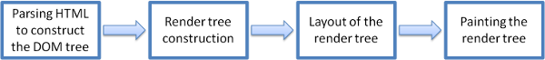

**Çevirmen**: *Mustafa Hasturk*

####Önsöz

Bu kapsamlı belge *Webkit* ve *Gecko* nın iç yapılarının araştırmasını içermektedir. İsrailli geliştirici *Tali Garsiel* uzun zaman ve emek harcayarak tarayıcıların kaynak kodlarını okumuş ve tarayıcıların iç yapısı ve çalışma mekanizması incelemiştir.  
  
  

Kendisi şöyle bir not düşmüş:
> IE'ın zamanlarında %90 gibi bir oranda hakimiyet sürerken tarayıcılara bir *kapalı kutu* olarak bakılıyor ve saygı duyuluyordu. Fakat şimdi açık kaynak tarayıcılar ile birlikte ______ÇEVİR_________. Tarayıcı çekirdeklerinin içine bakarak web tarayıcılarının içinde ne olduğunu görmek için tam sırası. Daha doğrusu milyonlarca C++ kodunun içinde ne olduğunu...

*Tali* araştırmalarını [kendi sitesinde](http://taligarsiel.com/) yayınladı fakat hepimiz biliyoruz ki daha fazla okuyucu kitlesini hak ediyor. Bu yüzden de çalışmayı düzenleyip burada yeniden yayınladık.

Bir web geliştiricisi olarak tarayıcı işlemlerinin iç yapısını öğrenmek bize daha iyi kararlar vermeyi ve geliştirmenin arkasındaki en iyi pratikleri bilmemizi sağlar. Bu belge oldukça uzun bir belge iken tüm detayları öğrenmek için biraz zaman harcamanızı öneriyoruz. Garanti ediyoruz ki harcadığınız zamana değecek. 

Ayrıca *Tali Garsiel*'in bu konu hakkındaki konuşmasını *Vimeo* üzerinden [buradan](http://vimeo.com/44182484) takip izleyebilirsiniz.

-----------------------------------------------------------------------------------------------------

##Giriş

Web tarayıcıları çok geniş çevrede kullanılan yazılımlardır. Bu el kitapçığı boyunca web tarayıcılarının arka planında neler döndüğünü ve nasıl çalıştığını anlatacağım. Tarayıcının adres çubuğuna `google.com` yazdığınızda taki ekranınıza *Google* yazısı gelinceye kadar neler döndüğüne bakacağız .

###Bahsedeceğimiz Tarayıcılar
Bu günlerde masaüstünde kullanılan beş ana tarayıcı şunlardır. *Opera*, *Chrome*, *Firefox*, *Safari* ve *Internet Explorer*. Mobil platformda ise ana tarayıcılar *Android Browser*, *iPhone*, *Opera Mini* ve *Opera Mobile*, *UC Browser*. Bu tarayıcıların bir çoğu *Webkit* i temel alıyor. Açık kaynak tarayıcılar olan *Chrome*, *Firefox* ve *Safari* (kısmen de olsa) den örnekler vereceğim.  
       
[StatCounter istatistiklerine](http://gs.statcounter.com/#all-browser-ww-monthly-201308-201408) göre tarayıcıların kullanım oranlarını resimden görebilirsiniz.

###Tarayıcıların Ana İşlevselliği
Tarayıcının ana görevi bizim seçtiğimiz web kaynağını, sunucuya istek yaparak ve tarayıcının penceresinde bize göstererek sunmaktır. Kaynak genellikle bir HTML belgesi iken PDF, görüntü veya farklı bir içeirk tipi de olabilir. Kaynağın konumu kullanıcı tarafından *URI* (Uniform Resource Identifier = Uniform_____ÇEVİR______ Kaynak Tanımlayıcı) kullanılarak belirtilir. 

Tarayıcı yorumlama ve HTML dosyalarının görüntülenmesinin yolu HTML ve CSS beyannamelerinde belirtilmiştir. Bu beyannameler [W3C](http://www.w3.org/) organizasyonu tarafından sürdürülmektedir ve bu organizasyon webin standartlarını oluşturmaktadır. Yıllardır tarayıcılar bu beyannamenin sadece belli bir kısmına uydular ve kendi uzantılarını geliştirdiler. Bunlar web yaratıcıları için ciddi uyumluluk sorunlarına neden oldu. Bugün ise bir çok tarayıcı bu beyannameye az veya çok şekilde uyuyorlar.

Tarayıcılar genel olarak çeşitli kullanıcı arayüzlerine sahipler. Bu genel arayüzler arasında;

* Adres (URI) girmek için kullanılacak bir adres çubuğu 
* İleri ve geri butonları
* Yer imleri seçeneği
* Geçerli belgeyi yenilemek veya durdurmak için gerekli yenileme ve durdurma butonları
* Ana sayfaya gitmek için kullanılacak ana sayfa butonu

yer almaktadır.  

Gariptir ki tarayıcıların kullanıcı arayüzleri herhangi bir resmi beyanname ile belirtilmemiştir. Bu arayüzler uzun yıllar süren, şekillenen iyi deneyimler ile meydana gelmektedir ve tarayıcılar birbirlerini taklit ederek / esinlenerek ilerlemektedirler. HTML5 beyannamesi, tarayıcıların sahip olması gerektiği herhangi bir UI yani kullanıcı arayüzü tanımlamaz fakat bazı ortak elemanları listeler. Bunların arasında; adres çubuğu, durum çubuğu ve araç çubuğu yer alır. UI yani kullanıcı arayüzü elemanları arasında tabi ki de tarayıcıya özgü elemanlar da vardır. Örneğin *Opera Browser*'ın *Discover* yani keşfet arayüzü gibi.

###Tarayıcının Yüksek Seviyeli Yapısı

Tarayıcının ana bileşenleri;  

1. **Kullanıcı arayüzü:** Adres çubuğu, ileri-geri butonu, yer imleri menüsü gibi elemanları içerir.  _____________ÇEVİR_____________

2. **Tarayıcı motoru:**: Rendering motoru ile kullanıcı arayüzü (UI) arasında sıraya koyma aksiyonlarını denetler.

3. **Rendering motoru::** İstek yapılmış içeriği görüntülemekten sorumludur. Örnek vermek gerekirse istek yapılmış içerik bir HTML ise rendering engine HTML ve CSS i çözümleri, ayrıştırır (parse) ve çözümlenmiş, ayrıştırılmış içeriği ekranda görüntüler. 

4. **Ağ iletişimi:** ağ (network) çağrıları örneğin HTTP istekleri için kullanılır. Platform bağımsız arayüzün arkasında farklı platformlar için farklı uygulamar kullanılır. 

5. **UI Arka Uç: (UI backend)** Combo boxes ve pencereler gibi basit grafiksel araçları çizmek için kullanılır. Bu arka uç (backend) platforma özel olmayan genel bir arayüz ortaya çıkarır 

6. **JavaScript Yorumlayıcı:** JavaScript kodlarını ayrıştırmak, çözümlemek (parse) ve çalıştırmak için kullanılır. 

7. **Veri Belleği: (data storage)** Bu bir süreklilik katmanıdır. Tarayıcı verilerin hepsini lokal olarak depolamaya ihtiyaç duyabilir. Çerezler (cookies) gibi. Ayrıca tarayıcılar farklı depolama mekanizmalarını da desteklerler. *localStorage, IndexedDB, WebSQL ve FileSystem* gibi.

##Rendering (Oluşturma) Motoru

Rendering motorunun sorumluluğu tam olarak rendering yani oluşturmak. Rendering istek yapılmış içeriği ekranda görüntülemektir. 

Varsayılan olarak rendering motoru HTML, XML belgelerinin yanı sıra resimleri görüntüleyebilir. Ayrıca eklentiler ve uzantılar sayesi ile diğer tip verileri görüntüleyebilir. Örneğin bir pdf eklentisi ile pdf dökümanları tarayıcı içerisinde görüntülenebilir. Fakat biz bu bölümde ana kullanım durumuna odaklanacağız. Ana kullanım durumumuz CSS ile biçimlenmiş HTML belgeleri ve resimleri görüntülemek.

###Rendering Motorları
Farklı tarayıcılar farklı rendering motorları kullanmaktadırlar.  
- *Chrome* ve *Opera* (15. sürümden itibaren) **Blink** (*WebKit*'in çatallanmış hali)  
- *Internet Explorer* **Trident**,  
- *Firefox* **Gecko**,  
- *Safari* **WebKit**  
kullanmaktadırlar. 

*WebKit* ilk zamanlar *Linux* platformu için oluşturulmuş açık kaynak bir rendering motorudur ve *Apple* tarafından *Mac* ve *Windows* platformunu desteklemek için değiştirilmiştir. Daha ayrıntılı bilgi için [webkit.org](http://www.webkit.org/)'a bakılabilir. 

###Ana Akış

Rendering motoru istek yapılmış belgenin içeriklerini ağ katmanından alacaktır. Bu işlem genellikle **8kB** ile gerçekleşecektir.  

Rendering motorunun temel akış diyagramı resimde görüldüğü gibidir.

